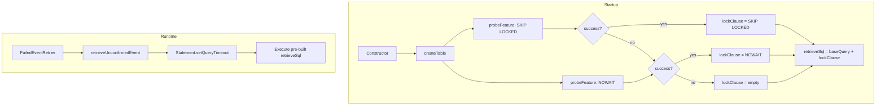

# Design Document: Probe-Based Lock Feature Detection

## Overview

Replace the version-based detection of `SKIP LOCKED` / `NOWAIT` support with a probe-based approach. At startup, execute real SQL against the database to determine what locking clauses are supported. This eliminates all version parsing logic and works universally across any database.

Key design principle: subclasses provide only the base SELECT query (database-specific WHERE/LIMIT syntax). The base class owns all locking clause logic — probing, selecting the best strategy, and appending the clause.

## Design Decisions

### SQL Syntax Portability

`FOR UPDATE SKIP LOCKED` and `FOR UPDATE NOWAIT` are not part of the SQL standard (ISO/IEC 9075). They are vendor extensions. However, all databases this project supports (PostgreSQL, MySQL, MariaDB, Oracle, H2) use identical syntax for both clauses. No vendor spells them differently.

SQL Server is the notable exception — it uses `WITH (UPDLOCK, READPAST)` instead of `FOR UPDATE SKIP LOCKED`. This project does not have a SQL Server persistenter, so this is not a current concern. If SQL Server support is added in the future, it would need its own subclass with different syntax, and the probe would correctly return `false` for the standard syntax, triggering the plain `FOR UPDATE` fallback.

This means the base class can safely append `FOR UPDATE SKIP LOCKED` or `FOR UPDATE NOWAIT` as a universal suffix across all currently supported databases.

### Transaction Timeout for Deadlock Protection

When `SKIP LOCKED` is not available and the system falls back to plain `FOR UPDATE`, concurrent retrier threads can deadlock. A configurable transaction timeout ensures the connection is released after a bounded time, preventing indefinite blocking.

Even with `SKIP LOCKED` or `NOWAIT`, a timeout is a good safety net — `NOWAIT` throws immediately on contention, but other lock-related edge cases (e.g., lock escalation, long-running queries) can still block.

The timeout is applied via `Statement.setQueryTimeout(seconds)` on the `Statement` used to execute the retrieve SQL. This approach is chosen over `Connection.setNetworkTimeout()` because `retrieveUnconfirmedEvent` uses a Spring-managed connection (`DataSourceUtils.getConnection`), and `setQueryTimeout` avoids interfering with the connection pool's own timeout settings while working across all JDBC drivers.

## Architecture



## Components

### LockFeatureProbe (new)

Utility class. Probes the database by executing `SELECT * FROM <table> WHERE 1=0 FOR UPDATE <clause>` inside a rolled-back transaction.

```java
package org.coderclan.whistle.rdbms;

public final class LockFeatureProbe {
    private LockFeatureProbe() {}

    /**
     * Test whether the database accepts a given FOR UPDATE clause.
     * Uses WHERE 1=0 so no rows are touched. Always rolls back.
     *
     * @param clause e.g. "SKIP LOCKED" or "NOWAIT"
     * @return true if the database accepted the clause
     */
    public static boolean probeFeature(DataSource dataSource, String tableName, String clause);
}
```

### WhistleConfigurationProperties (modified)

Add a `retrieveTransactionTimeout` property:

```java
@ConfigurationProperties("org.coderclan.whistle")
public class WhistleConfigurationProperties {
    // ... existing fields ...

    /**
     * Query timeout in seconds for the event retrieval SELECT ... FOR UPDATE statement.
     * Protects against deadlocks when SKIP LOCKED is not available.
     * Default: 5 seconds.
     */
    private int retrieveTransactionTimeout = 5;

    public int getRetrieveTransactionTimeout() {
        return retrieveTransactionTimeout;
    }

    public void setRetrieveTransactionTimeout(int retrieveTransactionTimeout) {
        this.retrieveTransactionTimeout = retrieveTransactionTimeout;
    }
}
```

Spring Boot property: `org.coderclan.whistle.retrieve-transaction-timeout=5`

### AbstractRdbmsEventPersistenter (modified)

Changes:
- Remove: `initMetaData()`, `detectSkipLockedSupport()`, `versionGreaterThan()`, `dbProductName`, `dbProductVersion`
- Remove: `getRetrieveSql(int count, boolean skipLockedSupported)` abstract method
- Add: `getBaseRetrieveSql(int count)` abstract method — subclasses return only the SELECT/WHERE/LIMIT part, no locking clause
- Add: `buildRetrieveSql()` — base class probes, picks best clause, appends it to the base query
- Add: `retrieveTransactionTimeout` field — received via constructor, applied as `Statement.setQueryTimeout()` in `retrieveUnconfirmedEvent`
- Keep: `supportsSkipLocked` and add `supportsNowait` as private fields (not exposed to subclasses)

Constructor flow:
```
1. createTable()
2. supportsSkipLocked = LockFeatureProbe.probeFeature(ds, table, "SKIP LOCKED")
3. supportsNowait     = LockFeatureProbe.probeFeature(ds, table, "NOWAIT")
4. retrieveSql        = buildRetrieveSql(RETRY_BATCH_COUNT)
5. this.retrieveTransactionTimeout = retrieveTransactionTimeout
```

Constructor signature:
```java
protected AbstractRdbmsEventPersistenter(DataSource dataSource, EventContentSerializer serializer,
        EventTypeRegistrar eventTypeRegistrar, String tableName, int retrieveTransactionTimeout) {
    // ... existing init ...
    this.retrieveTransactionTimeout = retrieveTransactionTimeout;
}
```

### Subclasses (simplified)

Each subclass replaces `getRetrieveSql(int, boolean)` with `getBaseRetrieveSql(int)`:

```java
// Before (e.g. MysqlEventPersistenter):
protected String getRetrieveSql(int count, boolean skipLockedSupported) {
    String base = "select ... where success=false and update_time<now()- INTERVAL 10 second ";
    if (skipLockedSupported) {
        return base + "limit " + count + " for update skip locked";
    } else {
        return base + "order by update_time, id limit " + count + " for update";
    }
}

// After:
protected String getBaseRetrieveSql(int count) {
    return "select id,event_type,event_content,retried_count from " + tableName
         + " where success=false and update_time<now()- INTERVAL 10 second "
         + "limit " + count;
}
```

Note: When neither SKIP LOCKED nor NOWAIT is available, the base class prepends `ORDER BY update_time, id` before the LIMIT. This requires the subclass to NOT include ORDER BY in the base query — the base class handles ordering as part of the fallback strategy. However, since each database has different LIMIT/OFFSET syntax and placement rules, the subclass provides a second method for the ordered variant:

```java
/**
 * Return the base retrieve SQL with deterministic ordering.
 * Used as fallback when neither SKIP LOCKED nor NOWAIT is supported.
 * Default implementation adds "ORDER BY update_time, id" — subclasses
 * override only if their SQL dialect requires different ordering placement.
 */
protected String getOrderedBaseRetrieveSql(int count) {
    return "select id,event_type,event_content,retried_count from " + tableName
         + " where success=false and update_time<now()- INTERVAL 10 second "
         + "order by update_time, id limit " + count;
}
```

### buildRetrieveSql in base class

```java
private String buildRetrieveSql(int count) {
    if (supportsSkipLocked) {
        return getBaseRetrieveSql(count) + " for update skip locked";
    } else if (supportsNowait) {
        return getBaseRetrieveSql(count) + " for update nowait";
    } else {
        return getOrderedBaseRetrieveSql(count) + " for update";
    }
}
```

### retrieveUnconfirmedEvent with query timeout

```java
@Override
@Transactional(rollbackFor = Exception.class)
public List<Event<?>> retrieveUnconfirmedEvent() {
    Connection conn = DataSourceUtils.getConnection(this.dataSource);
    try (Statement statement = conn.createStatement(ResultSet.TYPE_FORWARD_ONLY, ResultSet.CONCUR_UPDATABLE)) {
        statement.setQueryTimeout(this.retrieveTransactionTimeout);
        // ... rest of retrieval logic unchanged ...
    }
}
```

## Probe Algorithm

```java
static boolean probeFeature(DataSource dataSource, String tableName, String clause) {
    try (Connection conn = dataSource.getConnection()) {
        conn.setAutoCommit(false);
        try (Statement stmt = conn.createStatement()) {
            stmt.execute("SELECT * FROM " + tableName + " WHERE 1=0 FOR UPDATE " + clause);
        }
        conn.rollback();
        return true;
    } catch (SQLException e) {
        log.debug("Probe for '{}' not supported: {}", clause, e.getMessage());
        return false;
    }
}
```

- `WHERE 1=0` ensures zero rows are touched
- Connection is always closed via try-with-resources
- Transaction is rolled back on success, auto-rolled-back on exception when connection closes

## Subclass Changes Summary

| Subclass | `getBaseRetrieveSql` returns | `getOrderedBaseRetrieveSql` returns |
|---|---|---|
| H2 | `SELECT ... WHERE ... LIMIT n` | `SELECT ... WHERE ... ORDER BY update_time, id LIMIT n` |
| MySQL | `SELECT ... WHERE ... LIMIT n` | `SELECT ... WHERE ... ORDER BY update_time, id LIMIT n` |
| PostgreSQL | `SELECT ... WHERE ... LIMIT n` | `SELECT ... WHERE ... ORDER BY update_time, id LIMIT n` |
| Oracle | `SELECT ... WHERE ...` (no LIMIT — uses ROWNUM or FETCH FIRST) | `SELECT ... WHERE ... ORDER BY update_time, id` (with FETCH FIRST) |

## Correctness Properties

*A property is a characteristic or behavior that should hold true across all valid executions of a system — essentially, a formal statement about what the system should do. Properties serve as the bridge between human-readable specifications and machine-verifiable correctness guarantees.*

### Property 1: Probe is side-effect-free

*For any* table state (with zero or more rows) and *for any* clause string (valid or invalid), executing `probeFeature` SHALL leave the table row count unchanged.

**Validates: Requirements 1.4, 2.1, 2.3**

### Property 2: Locking clause priority selection

*For any* combination of `(supportsSkipLocked, supportsNowait)` boolean values, `buildRetrieveSql` SHALL select the locking clause following the strict priority: if `supportsSkipLocked` is true, the result contains `SKIP LOCKED`; else if `supportsNowait` is true, the result contains `NOWAIT`; else the result uses the Ordered_Base_Query with plain `FOR UPDATE`.

**Validates: Requirements 3.1, 3.2, 3.3, 3.4, 4.1, 4.2, 4.3**

### Property 3: Retrieve SQL always contains FOR UPDATE

*For any* combination of probe results, the constructed Retrieve_SQL SHALL always contain the substring `FOR UPDATE`.

**Validates: Requirements 4.1, 4.2, 4.3**

### Property 4: Base queries contain no locking clauses

*For any* positive count value, the string returned by `getBaseRetrieveSql(count)` SHALL NOT contain `FOR UPDATE`, `SKIP LOCKED`, or `NOWAIT`, and the string returned by `getOrderedBaseRetrieveSql(count)` SHALL NOT contain `FOR UPDATE`, `SKIP LOCKED`, or `NOWAIT`.

**Validates: Requirements 5.1, 5.2**

### Property 5: Query timeout is always applied

*For any* positive `retrieveTransactionTimeout` value, the `Statement` used in `retrieveUnconfirmedEvent` SHALL have `setQueryTimeout` called with that value before query execution.

**Validates: Requirements 9.1, 9.2, 9.3**

## Error Handling

| Scenario | Behavior | Logging |
|---|---|---|
| DB doesn't support the clause | `SQLException` caught, probe returns `false`, falls back to weaker strategy | DEBUG — log clause name and exception message |
| DataSource can't provide connection | `SQLException` caught, probe returns `false` | ERROR — log exception (connection failure is critical) |
| Table doesn't exist at probe time | Probe SQL fails, returns `false` (same as today — system can't function without the table) | ERROR — log exception (missing table is critical) |
| Query exceeds timeout | `SQLException` thrown by JDBC driver, caught by existing catch block in `retrieveUnconfirmedEvent`, returns empty list | ERROR — log exception message and timeout value |
| Timeout value is 0 | JDBC spec: 0 means no timeout (unlimited). Escape hatch if users want to disable the safety net | INFO — log at startup that timeout is disabled |
| Timeout value is negative | Reject at configuration validation time. `Statement.setQueryTimeout` throws `SQLException` for negative values | WARN — log invalid configuration, fall back to default (5s) |

## Testing Strategy

- jqwik property tests against embedded H2 (already on test classpath)
- Property: probes always return boolean, never throw
- Property: after probe, table row count is unchanged (side-effect-free)
- Property: `buildRetrieveSql` output always contains `FOR UPDATE`
- Property: `setQueryTimeout` is called with the configured value before query execution
