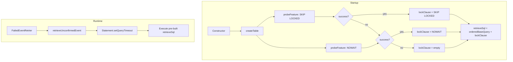
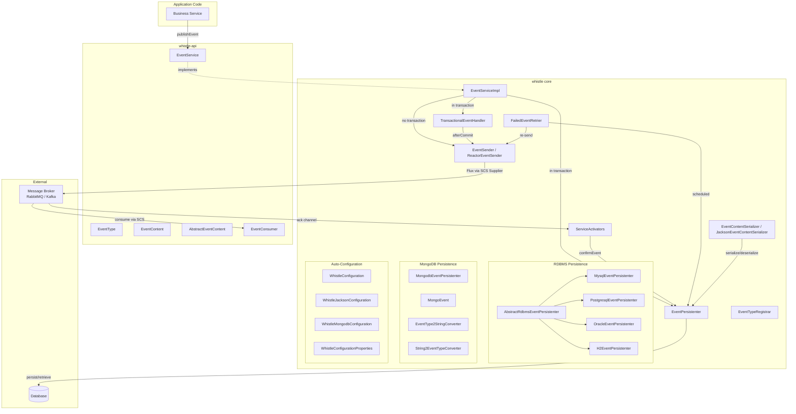
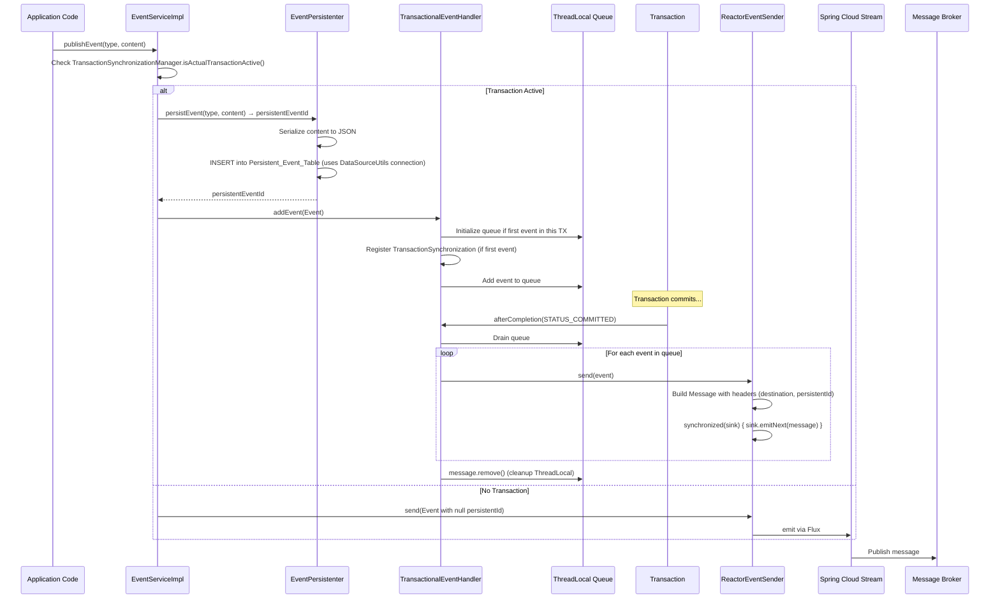
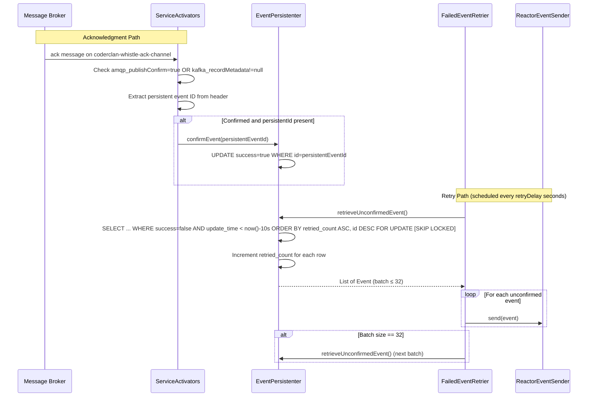

# Design Document: Whistle Event System

## Overview

Whistle is a reliable event delivering and consuming library for Java Spring Boot applications. It implements the Transactional Outbox pattern to solve the dual-write problem in Event-Driven Architecture: business data and events are persisted atomically within the same database transaction, then events are asynchronously published to a message broker (RabbitMQ or Kafka) via Spring Cloud Stream after the transaction commits. Broker acknowledgments confirm delivery, and a scheduled retrier re-sends any unconfirmed events.

### Compatibility Matrix

| Dimension | Supported Range | Notes |
|---|---|---|
| Java | 8+ (8, 11, 17, 21, 25) | Public API (`whistle-api`) uses only Java 8 APIs |
| Spring Boot | 2.x (2.6.4+), 3.x, and 4.x | Verified on Spring Boot 2, 3, and 4 environments |
| Spring Cloud | 2020.0.4+ (Spring Boot 2.x), 2022.0.x+ (Spring Boot 3.x), 2025.1.0 (Spring Boot 4.x) | Message broker abstracted via Spring Cloud Stream |
| javax/jakarta | Compatible with both javax and jakarta namespaces | Dual-annotation strategy for 2.x; jakarta-only for 3.x/4.x |
| Jackson | Jackson 2 (`com.fasterxml.jackson`) and Jackson 3 (`tools.jackson`) | Version-adaptive mechanism selects at runtime based on classpath |

### javax/jakarta Namespace Compatibility Strategy

Spring Boot 3.x migrated `javax.*` to `jakarta.*` (Jakarta EE 9+). Spring Boot 4.x (Spring Framework 7) only processes `jakarta.annotation.PostConstruct`. Whistle handles this as follows:

1. For lifecycle annotations, the `@javax.annotation.PostConstruct` and `@jakarta.annotation.PostConstruct` annotations have both been removed. Instead, `WhistleConfiguration` implements `InitializingBean` and performs initialization in `afterPropertiesSet()`. This is compatible with Spring Boot 2.x, 3.x, and 4.x without any javax/jakarta annotation dependency.

2. `jakarta.annotation-api` is declared with `provided` scope, so it does not propagate to the application's runtime classpath.

3. `javax.sql.DataSource` is part of the Java SE standard library (`java.sql` module) and is unaffected by the Jakarta EE namespace migration.

4. Beyond `@PostConstruct`, Whistle does not use any other Java EE javax.* APIs (e.g., `javax.inject`, `javax.persistence`), relying solely on Spring Framework annotations (`@Autowired`, `@Configuration`, etc.).

### Multi-Version Auto-Configuration Strategy

To support Spring Boot 2.x, 3.x, and 4.x, Whistle uses a dual registration mechanism:

- `META-INF/spring.factories` — Spring Boot 2.x auto-configuration discovery
- `META-INF/spring/org.springframework.boot.autoconfigure.AutoConfiguration.imports` — Spring Boot 3.x / 4.x auto-configuration discovery

Both files reference the same configuration classes (`WhistleJacksonConfiguration`, `WhistleConfiguration`, and `WhistleMongodbConfiguration`). Spring Boot 2.x ignores `AutoConfiguration.imports`, Spring Boot 3.x supports both but prefers `AutoConfiguration.imports`, and Spring Boot 4.x uses only `AutoConfiguration.imports`. No conflicts arise from their coexistence.

### Auto-Configuration Class Path Migration (Spring Boot 4)

Several auto-configuration classes were relocated in Spring Boot 4:

| Old Path (Spring Boot 2.x/3.x) | New Path (Spring Boot 4.x) |
|---|---|
| `o.s.b.autoconfigure.jdbc.DataSourceAutoConfiguration` | `o.s.b.jdbc.autoconfigure.DataSourceAutoConfiguration` |
| `o.s.b.autoconfigure.mongo.MongoAutoConfiguration` | `o.s.b.mongodb.autoconfigure.MongoAutoConfiguration` |

Whistle uses string-based `@AutoConfigureAfter(name=...)` annotations that list both old and new paths. When the referenced class is not on the classpath, the string-based reference does not trigger `ClassNotFoundException`. The framework ignores names that don't resolve.

For `WhistleConfiguration`:
```java
@AutoConfigureAfter(name = {
    "org.springframework.boot.autoconfigure.jdbc.DataSourceAutoConfiguration",  // Spring Boot 2.x/3.x
    "org.springframework.boot.jdbc.autoconfigure.DataSourceAutoConfiguration",  // Spring Boot 4.x
    "org.coderclan.whistle.WhistleMongodbConfiguration"
})
```

For `WhistleMongodbConfiguration`:
```java
@AutoConfigureAfter(name = {
    "org.springframework.boot.autoconfigure.mongo.MongoAutoConfiguration",    // Spring Boot 2.x/3.x
    "org.springframework.boot.mongodb.autoconfigure.MongoAutoConfiguration"   // Spring Boot 4.x
})
@ConditionalOnClass(MongoCustomConversions.class)  // stable across versions
```

### Jackson 2/3 Dual-Support Strategy (Spring Boot 4)

Spring Boot 4 replaces Jackson 2 (`com.fasterxml.jackson`) with Jackson 3 (`tools.jackson`). Whistle uses static inner configuration classes with `@ConditionalOnClass` to select the appropriate Jackson version at runtime.

The outer class (`WhistleJacksonConfiguration`) contains no Jackson imports. Two static inner `@Configuration` classes are each guarded by `@ConditionalOnClass` on the respective Jackson `ObjectMapper`. The JVM loads static inner classes lazily, so the Jackson 2 inner class is never loaded on Spring Boot 4 (where only Jackson 3 exists), and vice versa.

```mermaid
graph TB
    subgraph "WhistleJacksonConfiguration"
        WJC[WhistleJacksonConfiguration<br/>No Jackson imports]
        subgraph "Static Inner Classes"
            J2C[Jackson2Configuration<br/>@ConditionalOnClass Jackson 2 ObjectMapper]
            J3C[Jackson3Configuration<br/>@ConditionalOnClass Jackson 3 ObjectMapper]
        end
    end

    J2C -->|creates| J2S[JacksonEventContentSerializer]
    J3C -->|creates| J3S[Jackson3EventContentSerializer]
```

```java
@Configuration
public class WhistleJacksonConfiguration {

    @Configuration
    @ConditionalOnClass(name = "com.fasterxml.jackson.databind.ObjectMapper")
    static class Jackson2Configuration {
        @Bean
        @ConditionalOnMissingBean(EventContentSerializer.class)
        public EventContentSerializer eventContentSerializer(
                @Autowired com.fasterxml.jackson.databind.ObjectMapper objectMapper) {
            return new JacksonEventContentSerializer(objectMapper);
        }
    }

    @Configuration
    @ConditionalOnClass(name = "tools.jackson.databind.ObjectMapper")
    static class Jackson3Configuration {
        @Bean
        @ConditionalOnMissingBean(EventContentSerializer.class)
        public EventContentSerializer eventContentSerializer(
                @Autowired tools.jackson.databind.ObjectMapper objectMapper) {
            return new Jackson3EventContentSerializer(objectMapper);
        }
    }
}
```

Key decisions:
- `eventContentSerializer` bean removed from `WhistleConfiguration` to eliminate Jackson class references from its method signatures.
- `@ConditionalOnMissingBean(EventContentSerializer.class)` on both ensures only one activates.
- `WhistleJacksonConfiguration` uses `@AutoConfigureBefore(name = "org.coderclan.whistle.WhistleConfiguration")` to ensure the `EventContentSerializer` bean is available before the persistenter beans.
- Spring Boot 2.x/3.x → Jackson 2 on classpath → `Jackson2Configuration` activates.
- Spring Boot 4.x → Jackson 3 on classpath → `Jackson3Configuration` activates.
- Custom `EventContentSerializer` bean overrides both (existing behavior preserved).

Compile-time dependency handling: Jackson 3 (`tools.jackson.databind:jackson-databind`) is declared as an `optional` Maven dependency in `whistle/pom.xml`. It is available at compile time but does not transitively propagate to consumers. At runtime on Spring Boot 2.x/3.x, `@ConditionalOnClass` prevents the Jackson 3 inner class from loading. On Spring Boot 4.x, Jackson 3 is provided by the Spring Boot BOM.

`Jackson3EventContentSerializer` implementation:
```java
public class Jackson3EventContentSerializer implements EventContentSerializer {
    private tools.jackson.databind.ObjectMapper objectMapper;

    public Jackson3EventContentSerializer(tools.jackson.databind.ObjectMapper objectMapper) {
        this.objectMapper = objectMapper;
    }

    @Override
    public EventContent toEventContent(String string, Class<? extends EventContent> contentType) {
        try {
            return this.objectMapper.readValue(string, contentType);
        } catch (tools.jackson.core.JacksonException e) {
            throw new EventContentSerializationException(e);
        }
    }

    @Override
    public <C extends EventContent> String toJson(C content) {
        try {
            return this.objectMapper.writeValueAsString(content);
        } catch (tools.jackson.core.JacksonException e) {
            throw new EventContentSerializationException(e);
        }
    }
}
```

### Spring Cloud Stream 5.0 Compatibility

No code changes needed. Whistle already uses the functional programming model (`Supplier<Flux<Message<EventContent>>>`) and does not reference `@EnableBinding`, `@StreamListener`, or `RabbitAutoConfiguration`.

### Unified Retry Ordering Strategy

All persistenter implementations (RDBMS and MongoDB) use a consistent ordering for retrieving unconfirmed events: `ORDER BY retried_count ASC, id DESC`.

1. `retried_count ASC` (RDBMS) / `retry ASC` (MongoDB): Events with fewer retries are processed first. This acts as a natural backoff mechanism — "poison" events that repeatedly fail accumulate a high retry count and gradually sink to the bottom of the queue.

2. `id DESC`: Among events with the same retry count, newer events are processed first. This prioritizes recent events that are most likely to succeed (e.g., events created after a transient broker outage is resolved).

| Failure Scenario | Behavior with `retried_count ASC, id DESC` |
|---|---|
| Broker down (RabbitMQ/Kafka unavailable) | All events fail equally regardless of order. Once the broker recovers, all unconfirmed events are retried. Order is irrelevant. |
| Missing exchange/topic | All events of that type fail equally. Order is irrelevant. |
| Buggy event (poison message) | The poison event's retry count increments each cycle, causing it to sink below newer healthy events. This prevents a single poison event from blocking the entire retry queue. |

All three RDBMS locking paths (SKIP LOCKED, NOWAIT, plain FOR UPDATE) use `getOrderedBaseRetrieveSql()` which includes `ORDER BY retried_count ASC, id DESC`. The previously used `getBaseRetrieveSql()` (unordered) has been removed as dead code.

For RDBMS, no schema changes are needed — the `retried_count` and `id` columns already exist. For optimal performance on the fallback path, a composite index on `(retried_count, id DESC)` filtered by `success = false` could be added, but this is optional since the fallback path is only used on older database versions.

### Probe-Based Lock Feature Detection

At startup, `AbstractRdbmsEventPersistenter` probes the database by executing real SQL to determine which locking clauses (`SKIP LOCKED`, `NOWAIT`) are supported. This replaces the previous version-based detection approach, eliminating all version parsing logic and working universally across any database.

Key design principle: subclasses provide only the base SELECT query (database-specific WHERE/LIMIT syntax). The base class owns all locking clause logic — probing, selecting the best strategy, and appending the clause.

#### SQL Syntax Portability

`FOR UPDATE SKIP LOCKED` and `FOR UPDATE NOWAIT` are not part of the SQL standard (ISO/IEC 9075). They are vendor extensions. However, all databases this project supports (PostgreSQL, MySQL, MariaDB, Oracle, H2) use identical syntax for both clauses. No vendor spells them differently. SQL Server is the notable exception — it uses `WITH (UPDLOCK, READPAST)` instead of `FOR UPDATE SKIP LOCKED`. This project does not have a SQL Server persistenter, so this is not a current concern. If SQL Server support is added in the future, the probe would correctly return `false` for the standard syntax, triggering the plain `FOR UPDATE` fallback.

#### Transaction Timeout for Deadlock Protection

When `SKIP LOCKED` is not available and the system falls back to plain `FOR UPDATE`, concurrent retrier threads can deadlock. A configurable transaction timeout (`retrieveTransactionTimeout`, default 5 seconds) ensures the connection is released after a bounded time, preventing indefinite blocking. Even with `SKIP LOCKED` or `NOWAIT`, a timeout is a good safety net for lock-related edge cases.

The timeout is applied via `Statement.setQueryTimeout(seconds)`. This approach is chosen over `Connection.setNetworkTimeout()` because `retrieveUnconfirmedEvent` uses a Spring-managed connection (`DataSourceUtils.getConnection`), and `setQueryTimeout` avoids interfering with the connection pool's own timeout settings while working across all JDBC drivers.

#### Probe Algorithm

```java
static boolean probeFeature(DataSource dataSource, String tableName, String clause) {
    try (Connection conn = dataSource.getConnection()) {
        conn.setAutoCommit(false);
        try (Statement stmt = conn.createStatement()) {
            stmt.execute("SELECT * FROM " + tableName + " WHERE 1=0 FOR UPDATE " + clause);
        }
        conn.rollback();
        return true;
    } catch (SQLException e) {
        log.debug("Probe for '{}' not supported: {}", clause, e.getMessage());
        return false;
    }
}
```

- `WHERE 1=0` ensures zero rows are touched
- Connection is always closed via try-with-resources
- Transaction is rolled back on success, auto-rolled-back on exception when connection closes

#### Constructor Startup Sequence



```
1. createTable()
2. supportsSkipLocked = LockFeatureProbe.probeFeature(ds, table, "SKIP LOCKED")
3. supportsNowait     = LockFeatureProbe.probeFeature(ds, table, "NOWAIT")
4. retrieveSql        = buildRetrieveSql(RETRY_BATCH_COUNT)
5. this.retrieveTransactionTimeout = retrieveTransactionTimeout
```

#### buildRetrieveSql

```java
private String buildRetrieveSql(int count) {
    if (supportsSkipLocked) {
        return getOrderedBaseRetrieveSql(count) + " for update skip locked";
    } else if (supportsNowait) {
        return getOrderedBaseRetrieveSql(count) + " for update nowait";
    } else {
        return getOrderedBaseRetrieveSql(count) + " for update";
    }
}
```

#### Subclass getOrderedBaseRetrieveSql Summary

| Subclass | `getOrderedBaseRetrieveSql` returns |
|---|---|
| H2 | `SELECT id, ... WHERE ... ORDER BY retried_count ASC, id DESC LIMIT n` |
| MySQL | `SELECT id, ... WHERE ... ORDER BY retried_count ASC, id DESC LIMIT n` |
| PostgreSQL | `SELECT id, ... WHERE ... ORDER BY retried_count ASC, id DESC LIMIT n` |
| Oracle | `SELECT rowid, ... WHERE ... ORDER BY retried_count ASC, id DESC` (no LIMIT — ORA-02014 prevents FETCH FIRST with FOR UPDATE; row limiting enforced by Java-side loop guard; uses `systimestamp` for timestamp comparison) |

The project is organized as a multi-module Maven project (version 1.2.0):

| Module | Purpose |
|---|---|
| `whistle-api` | Public API interfaces (`EventService`, `EventType`, `EventContent`, `EventConsumer`) with zero framework dependencies |
| `whistle` | Core implementation: persistence, sending, retry, auto-configuration |
| `whistle-example-producer-api` | Shared event type definitions for examples |
| `whistle-example-producer` | RDBMS-based producer example |
| `whistle-example-producer-mongo` | MongoDB-based producer example |
| `whistle-example-consumer` | Consumer example |

Key design decisions:
- **Transactional Outbox pattern** ensures events are never lost even if the broker is temporarily unavailable.
- **Database-agnostic persistence** via the Template Method pattern, with concrete implementations for MySQL, PostgreSQL, Oracle, H2, and MongoDB.
- **Spring Boot auto-configuration** with `@ConditionalOnClass` / `@ConditionalOnBean` / `@ConditionalOnMissingBean` for zero-config setup.
- **Reactor Sinks.Many** as the bridge between imperative event publishing and Spring Cloud Stream's reactive Supplier model.
- **SKIP LOCKED** used when the database supports it, to enable concurrent retry without row-level contention.
- **Consistent `ORDER BY retried_count ASC, id DESC`** across all locking paths (SKIP LOCKED, NOWAIT, plain FOR UPDATE) to deprioritize poison events.

## Architecture



### Transactional Publish Flow



### Acknowledgment and Retry Flow



## Components and Interfaces

### whistle-api Module

| Interface/Class | Responsibility |
|---|---|
| `EventService` | Single method `publishEvent(EventType, EventContent)` — the public API for producers |
| `EventType<C>` | Identifies an event category: `getName()` returns a globally unique name, `getContentType()` returns the `Class<C>` |
| `EventContent` | Marker interface extending `Serializable` — the event payload contract |
| `AbstractEventContent` | Base class providing UUID-based `idempotentId` and `Instant time`; `equals`/`hashCode` based on `idempotentId` |
| `EventConsumer<E>` | Extends `Consumer<E>`. Implementations provide `getSupportEventType()` and `consume(E)`. The default `accept()` wraps failures in `ConsumerException` |
| `ConsumerException` | RuntimeException wrapping consumer failures |

### whistle Core Module

| Interface/Class | Responsibility |
|---|---|
| `EventServiceImpl` | Implements `EventService`. If a TX is active: persist + queue via `TransactionalEventHandler`. Otherwise: send directly. `@ThreadSafe` |
| `TransactionalEventHandler` | Uses `ThreadLocal<Queue<Event>>` and `TransactionSynchronization.afterCompletion()` to send events only after TX commit. `@ThreadSafe` |
| `EventSender` | Interface: `send(Event)` and `asFlux()` |
| `ReactorEventSender` | Implements `EventSender` using `Sinks.Many<Message<EventContent>>` (unicast, backpressure buffer). `synchronized(sink)` for thread safety |
| `EventPersistenter` | Interface: `persistEvent()`, `confirmEvent()`, `retrieveUnconfirmedEvent()` |
| `AbstractRdbmsEventPersistenter` | Template Method base for RDBMS. Handles table creation, SKIP LOCKED detection, insert/confirm/retrieve logic. Uses `DataSourceUtils.getConnection()` for TX participation. All locking paths use `getOrderedBaseRetrieveSql()` with `ORDER BY retried_count ASC, id DESC` |
| `MysqlEventPersistenter` | MySQL-specific SQL (AUTO_INCREMENT, `now()` syntax) |
| `PostgresqlEventPersistenter` | PostgreSQL-specific SQL (bigserial, trigger for update_time) |
| `OracleEventPersistenter` | Oracle-specific SQL (SEQUENCE, NUMBER types, TRIGGER). Uses `ROWID` instead of `id` for row identification in retrieval and confirmation — consistent with Oracle JDBC's default `getGeneratedKeys()` behavior which returns ROWID, and provides faster direct physical row access. Omits `FETCH FIRST n ROWS ONLY` from retrieve SQL because Oracle raises ORA-02014 when combined with `FOR UPDATE`; row limiting is enforced by the Java-side loop guard. Uses `systimestamp` for timestamp comparison |
| `H2EventPersistenter` | H2-specific SQL (AUTO_INCREMENT, ON UPDATE CURRENT_TIMESTAMP) |
| `LockFeatureProbe` | Utility class that probes the database at startup to determine whether `FOR UPDATE SKIP LOCKED` and `FOR UPDATE NOWAIT` are supported. Executes `SELECT * FROM <table> WHERE 1=0 FOR UPDATE <clause>` inside a rolled-back transaction. Side-effect-free and safe to run at startup |
| `MongodbEventPersistenter` | MongoDB implementation using `MongoTemplate`. Compound partial index on `{retry: 1, _id: -1}` filtered for `confirmed:false` |
| `MongoEvent<C>` | `@Document("sys_event_out")` — MongoDB document model |
| `EventType2StringConverter` | `@WritingConverter` — `EventType` → `String` for MongoDB |
| `String2EventTypeConverter` | `@ReadingConverter` — `String` → `EventType` via `EventTypeRegistrar` |
| `FailedEventRetrier` | `ApplicationListener<ApplicationStartedEvent>`. Starts a `ScheduledExecutorService` that polls unconfirmed events every `retryDelay` seconds |
| `ServiceActivators` | `@ServiceActivator` on `coderclan-whistle-ack-channel` for broker acks; `errorChannel` for errors |
| `EventContentSerializer` | Interface: `toJson(EventContent)` and `toEventContent(String, Class)` |
| `JacksonEventContentSerializer` | Jackson 2 (`com.fasterxml.jackson`) `ObjectMapper`-based implementation |
| `Jackson3EventContentSerializer` | Jackson 3 (`tools.jackson`) `ObjectMapper`-based implementation |
| `WhistleJacksonConfiguration` | Outer `@Configuration` with no Jackson imports. Contains two static inner `@Configuration` classes for Jackson 2 and Jackson 3, each guarded by `@ConditionalOnClass` |
| `EventTypeRegistrar` | Collects all `EventType` instances into an immutable `Map<String, EventType>`. Throws `DuplicatedEventTypeException` on name collision. `@ThreadSafe` |
| `Event<C>` | `@Immutable` value object: `persistentEventId`, `type`, `content` |
| `Constants` | `EVENT_PERSISTENT_ID_HEADER = "org-coderclan-whistle-persistent-id"`, `RETRY_BATCH_COUNT = 32` |
| `WhistleConfigurationProperties` | `@ConfigurationProperties("org.coderclan.whistle")`: `retryDelay` (default 10), `applicationName` (default `spring.application.name`), `persistentTableName` (default `sys_event_out`), `retrieveTransactionTimeout` (default 5 seconds) |
| `WhistleConfiguration` | Main `@Configuration`. Implements `ApplicationContextAware` and `InitializingBean`. Auto-configures all beans (except Jackson serializer, which is in `WhistleJacksonConfiguration`). Validates no overlap between produced and consumed event types. Registers consumer bindings via `System.setProperty()`. Uses string-based `@AutoConfigureAfter(name=...)` for cross-version compatibility |
| `WhistleMongodbConfiguration` | `@Configuration` conditional on `MongoCustomConversions.class`. Registers MongoDB persistenter and custom converters. Uses string-based `@AutoConfigureAfter(name=...)` for cross-version compatibility |

### Design Decision: JSON-Based String Serialization for EventContentSerializer

The `EventContentSerializer` interface uses `String` (JSON text) as the serialization format rather than `byte[]` (which would support binary protocols like Protobuf). This is a deliberate design choice:

- JSON covers the vast majority of event-driven use cases. Transactional outbox events are typically business domain events (order created, payment processed), not high-throughput RPC payloads where binary serialization matters.
- The performance bottleneck in the transactional outbox pattern is the database write (INSERT within a transaction), not serialization. Switching to Protobuf would not meaningfully improve end-to-end latency.
- JSON is human-readable, which is critical for debugging, log inspection, and manual database queries against the `sys_event_out` table. Binary formats require additional tooling to inspect.
- JSON is natively supported by all message brokers (RabbitMQ, Kafka) and all databases (varchar columns). Binary formats would require schema changes (`BLOB`/`BYTEA`) and broker configuration changes.
- The `@ConditionalOnMissingBean` guard on the serializer bean already allows users to provide a custom `EventContentSerializer` implementation for specialized needs (e.g., a Protobuf-to-JSON bridge).
- Changing to `byte[]` would be a breaking change affecting the interface, all persistenter implementations, the database schema, and the message wire format — a scope far beyond what any single feature should introduce.

If binary protocol support is needed in the future, it should be introduced as a new `EventContentCodec` interface in a major version release, with a backward-compatible adapter for the existing `EventContentSerializer`.

### Exception Hierarchy

| Exception | Module | Thrown When |
|---|---|---|
| `ConsumerException` | whistle-api | Consumer returns false or throws |
| `DuplicatedEventTypeException` | whistle | Two different EventType instances share the same name |
| `EventContentSerializationException` | whistle | Jackson serialization/deserialization fails (both Jackson 2 and Jackson 3) |
| `EventContentDeserializationException` | whistle | (Available but currently `EventContentSerializationException` is used for both directions) |
| `EventContentTypeNotFoundException` | whistle | Event type name not found in registrar |
| `EventPersistenceException` | whistle | SQL exception during `persistEvent()` in `AbstractRdbmsEventPersistenter`. Extends `RuntimeException` |

## Data Models

### Event<C> (Internal Value Object)

```java
@Immutable
public class Event<C extends EventContent> {
    private final String persistentEventId;  // nullable (null when no TX)
    private final EventType<C> type;
    private final C content;
}
```

`equals`/`hashCode` based on `type` and `content` (not `persistentEventId`).

### AbstractEventContent (API Base Class)

```java
public abstract class AbstractEventContent implements EventContent {
    private String idempotentId = UUID.randomUUID().toString();
    private Instant time = Instant.now();
}
```

`equals`/`hashCode` based solely on `idempotentId`.

### RDBMS Persistent_Event_Table Schema

Default table name: `sys_event_out` (configurable via `org.coderclan.whistle.persistentTableName`).

| Column | MySQL | PostgreSQL | Oracle | H2 |
|---|---|---|---|---|
| `id` | `int unsigned AUTO_INCREMENT` PK | `bigserial` PK | `NUMBER DEFAULT SEQ.NEXTVAL` PK | `int AUTO_INCREMENT` PK |
| `event_type` | `varchar(128)` | `varchar(128)` | `VARCHAR2(128)` | `varchar(128)` |
| `retried_count` | `int unsigned DEFAULT 0` | `int DEFAULT 0` | `NUMBER DEFAULT 0` | `int DEFAULT 0` |
| `event_content` | `varchar(4096)` | `varchar(4096)` | `VARCHAR2(2000)` | `varchar(4096)` |
| `success` | `boolean DEFAULT false` | `boolean DEFAULT false` | `NUMBER(1,0) DEFAULT 0` | `boolean DEFAULT false` |
| `create_time` | `timestamp DEFAULT CURRENT_TIMESTAMP` | `timestamp DEFAULT CURRENT_TIMESTAMP` | `TIMESTAMP DEFAULT current_timestamp` | `timestamp DEFAULT CURRENT_TIMESTAMP` |
| `update_time` | `timestamp DEFAULT CURRENT_TIMESTAMP ON UPDATE CURRENT_TIMESTAMP` | `timestamp DEFAULT CURRENT_TIMESTAMP` (trigger-updated) | `TIMESTAMP DEFAULT current_timestamp` (trigger-updated) | `timestamp DEFAULT CURRENT_TIMESTAMP ON UPDATE CURRENT_TIMESTAMP` |

PostgreSQL and Oracle use database triggers to auto-update `update_time` on row modification.

Oracle-specific note: Although the `id` column exists as the primary key, `OracleEventPersistenter` uses Oracle `ROWID` (a pseudo-column) instead of `id` for row identification in retrieval and confirmation queries. The primary reason is that Oracle JDBC's `Statement.RETURN_GENERATED_KEYS` returns the ROWID by default (not the sequence-generated `id`), so `persistEvent()` naturally returns a ROWID. Using ROWID consistently in retrieval (`SELECT rowid, ...`) and confirmation (`WHERE rowid=?`) keeps the identifier uniform across all code paths. ROWID also provides faster row access than a primary key index lookup since it is the direct physical row address. The confirm SQL uses `WHERE rowid=?` and `fillDbId()` uses `PreparedStatement.setString()` since ROWID is a string value.

Trade-off: ROWID can become stale if the row is physically moved by DBA operations such as `ALTER TABLE ... MOVE`, `SHRINK SPACE`, partition reorganization, or Data Pump export/import. If this happens between event retrieval and confirmation, the `UPDATE ... WHERE rowid=?` silently updates zero rows, leaving the event unconfirmed. The retry mechanism will re-retrieve the event with a fresh ROWID in the next cycle, so no data loss occurs. An alternative would be to use `prepareStatement(sql, new String[]{"ID"})` to get the sequence-generated `id` from `getGeneratedKeys()` and use `WHERE id=?` for confirmation — this would be stable across table reorganization but slightly slower due to index lookup. The current ROWID approach is preferred because table reorganization on a live event table is rare in practice.

Additionally, Oracle's retrieve SQL omits `FETCH FIRST n ROWS ONLY` because Oracle raises ORA-02014 when `FOR UPDATE` is combined with `FETCH FIRST`; row limiting is enforced by the Java-side loop guard (`eventCount < RETRY_BATCH_COUNT`). The staleness filter uses `systimestamp - INTERVAL '10' second` (Oracle's native high-precision timestamp function).

### MongoEvent (MongoDB Document)

```java
@Document("sys_event_out")
@CompoundIndex(
    name = "unconfirmed_retry_order",
    def = "{'retry': 1, '_id': -1}",
    partialFilter = "{'confirmed': false}"
)
public class MongoEvent<C extends EventContent> {
    @Id
    private String id;
    private EventType<C> type;    // stored as String via EventType2StringConverter
    private C content;
    private Boolean confirmed = false;
    private Integer retry = 0;
}
```

The compound partial index allows MongoDB to satisfy the `WHERE confirmed = false ORDER BY retry ASC, _id DESC LIMIT 32` query entirely from the index, avoiding in-memory sorts. The partial filter keeps the index small by only including unconfirmed documents.

### Spring Cloud Stream Default Properties

Loaded from `spring-cloud-stream.properties`:

```properties
spring.cloud.stream.poller.maxMessagesPerPoll=256
spring.rabbitmq.publisher-confirm-type=correlated
spring.rabbitmq.publisher-confirms=true
spring.rabbitmq.publisher-returns=true
spring.cloud.stream.default.producer.errorChannelEnabled=true
spring.cloud.stream.rabbit.default.consumer.auto-bind-dlq=true
spring.cloud.stream.rabbit.default.errorChannelEnabled=true
spring.cloud.stream.rabbit.default.producer.confirm-ack-channel=coderclan-whistle-ack-channel
spring.cloud.stream.kafka.binder.autoCreateTopics=true
spring.cloud.stream.kafka.binder.autoAddPartitions=true
spring.cloud.stream.kafka.binder.minPartitionCount=8
spring.cloud.stream.kafka.default.consumer.autoCommitOffset=true
spring.cloud.stream.kafka.default.consumer.enableDlq=true
spring.cloud.stream.kafka.default.producer.recordMetadataChannel=coderclan-whistle-ack-channel
```

## Correctness Properties

*A property is a characteristic or behavior that should hold true across all valid executions of a system — essentially, a formal statement about what the system should do. Properties serve as the bridge between human-readable specifications and machine-verifiable correctness guarantees.*

### Property 1: Transactional publish persists and queues

*For any* valid EventType and EventContent, when `publishEvent()` is called while a database transaction is active, the event SHALL be persisted via `EventPersistenter.persistEvent()` and the resulting Event (with the returned persistent ID) SHALL be added to the `TransactionalEventHandler` queue.

**Validates: Requirements 1.1**

### Property 2: Committed transaction sends all queued events

*For any* list of events added to the `TransactionalEventHandler` during a transaction, when `afterCompletion` is called with `STATUS_COMMITTED`, all events in the ThreadLocal queue SHALL be forwarded to `EventSender.send()` in order, and the ThreadLocal SHALL be cleaned up.

**Validates: Requirements 1.2**

### Property 3: Rolled-back transaction discards all queued events

*For any* list of events added to the `TransactionalEventHandler` during a transaction, when `afterCompletion` is called with a status other than `STATUS_COMMITTED`, zero events SHALL be forwarded to `EventSender.send()`, and the ThreadLocal SHALL be cleaned up.

**Validates: Requirements 1.3**

### Property 4: Non-transactional publish sends directly without persistence

*For any* valid EventType and EventContent, when `publishEvent()` is called while no database transaction is active, the event SHALL be sent directly via `EventSender.send()` with a null persistent event ID, and `EventPersistenter.persistEvent()` SHALL NOT be called.

**Validates: Requirements 1.4**

### Property 5: ThreadLocal isolates events between concurrent transactions

*For any* two threads each adding events to the `TransactionalEventHandler`, the events added by one thread SHALL NOT be visible to or sent by the other thread's transaction synchronization callback.

**Validates: Requirements 1.5, 14.3**

### Property 6: EventTypeRegistrar collects all registered types

*For any* set of publishing EventType collections and EventConsumer beans, the `EventTypeRegistrar` SHALL contain every EventType from both sources, and `findEventType(name)` SHALL return the correct EventType for each registered name.

**Validates: Requirements 2.1**

### Property 7: Duplicate event type names are rejected

*For any* two distinct EventType instances that return the same value from `getName()`, constructing an `EventTypeRegistrar` with both SHALL throw a `DuplicatedEventTypeException`.

**Validates: Requirements 2.3**

### Property 8: Producing and consuming the same event type is rejected

*For any* EventType that appears in both the publishing event type collections and the consumer event type set, the `WhistleConfiguration.checkEventType()` method SHALL throw an `IllegalStateException`.

**Validates: Requirements 2.5**

### Property 9: RDBMS persist inserts correct data and returns generated ID

*For any* valid EventType and EventContent, `AbstractRdbmsEventPersistenter.persistEvent()` SHALL insert a row with the event type name (from `EventType.getName()`) and the JSON-serialized content (from `EventContentSerializer.toJson()`), and return a non-null string representing the generated primary key.

**Validates: Requirements 3.1**

### Property 10: RDBMS confirm marks event as successful

*For any* valid persistent event ID, `AbstractRdbmsEventPersistenter.confirmEvent()` SHALL execute an UPDATE statement that sets the success flag to true for the row with that ID.

**Validates: Requirements 3.2**

### Property 11: RDBMS retrieve returns bounded batch with incremented retry count

*For any* set of unconfirmed events in the Persistent_Event_Table with update_time older than 10 seconds, `retrieveUnconfirmedEvent()` SHALL return at most 32 events and SHALL increment the `retried_count` for each returned event.

**Validates: Requirements 3.3**

### Property 12: SKIP LOCKED SQL generation matches database capability

*For any* database, the `AbstractRdbmsEventPersistenter` SHALL generate a retrieve SQL containing `SKIP LOCKED` if and only if the runtime SQL probe (`LockFeatureProbe.probeFeature()` executing `SELECT * FROM <table> WHERE 1=0 FOR UPDATE SKIP LOCKED`) succeeds at startup. If the SKIP LOCKED probe fails but the NOWAIT probe succeeds, the SQL SHALL contain `FOR UPDATE NOWAIT`. Otherwise, the SQL SHALL use `ORDER BY retried_count ASC, id DESC` with `FOR UPDATE`. All locking paths (SKIP LOCKED, NOWAIT, plain FOR UPDATE) SHALL include `ORDER BY retried_count ASC, id DESC` to ensure poison events are deprioritized.

**Validates: Requirements 3.4, 3.5, 3.6, 23.1, 23.2, 23.3**

### Property 13: MongoDB persist creates document with correct defaults

*For any* valid EventType and EventContent, `MongodbEventPersistenter.persistEvent()` SHALL insert a MongoEvent document with `confirmed=false` and `retry=0`, and return a non-null document ID.

**Validates: Requirements 4.1**

### Property 14: MongoDB confirm sets confirmed to true

*For any* valid persistent event ID, `MongodbEventPersistenter.confirmEvent()` SHALL update the corresponding MongoEvent document to set `confirmed=true`.

**Validates: Requirements 4.2**

### Property 15: MongoDB retrieve returns ordered bounded batch with incremented retry

*For any* set of unconfirmed MongoEvent documents, `retrieveUnconfirmedEvent()` SHALL return at most 32 documents ordered by retry ascending then ID descending, and SHALL increment the retry counter for all retrieved documents.

**Validates: Requirements 4.3**

### Property 16: Retry loop continues until batch is not full

*For any* number N of unconfirmed events in the database, the `FailedEventRetrier` runnable SHALL call `retrieveUnconfirmedEvent()` ceil(N/32) times (continuing while each batch returns exactly 32 events) and SHALL send each retrieved event via `EventSender.send()`.

**Validates: Requirements 6.3**

### Property 17: Event message contains correct headers and payload

*For any* Event with a given EventType, EventContent, and persistent event ID, `ReactorEventSender.send()` SHALL produce a Spring Message where the payload equals the EventContent, the `spring.cloud.stream.sendto.destination` header equals `EventType.getName()`, and the `org-coderclan-whistle-persistent-id` header equals the persistent event ID.

**Validates: Requirements 7.2**

### Property 18: Concurrent sends preserve all messages

*For any* set of events sent concurrently from multiple threads to `ReactorEventSender`, all events SHALL appear in the output Flux with no losses or duplicates.

**Validates: Requirements 7.4, 14.4**

### Property 19: Broker acknowledgment triggers event confirmation

*For any* acknowledgment message received on the `coderclan-whistle-ack-channel` that contains a non-null persistent event ID header and a positive confirmation signal (either `amqp_publishConfirm=true` or a non-null `kafka_recordMetadata`), `ServiceActivators.acks()` SHALL call `EventPersistenter.confirmEvent()` with that persistent event ID.

**Validates: Requirements 8.1, 8.2**

### Property 20: Serialization round trip preserves EventContent

*For any* valid EventContent object and its corresponding content type class, `toEventContent(toJson(content), contentType)` SHALL produce an object equal to the original content.

**Validates: Requirements 9.1, 9.2, 9.5**

### Property 21: Consumer binding uses event type name

*For any* EventConsumer bean with a given bean name and EventType, the `WhistleConfiguration.registerEventConsumers()` method SHALL set the system property `spring.cloud.stream.function.bindings.<beanName>-in-0` to the value of `EventType.getName()`.

**Validates: Requirements 10.2**

### Property 22: Consumer accept() wraps failures in ConsumerException

*For any* EventConsumer whose `consume()` method either returns false or throws an exception, calling `accept()` SHALL throw a `ConsumerException`.

**Validates: Requirements 10.4, 10.5**

### Property 23: Retrieve transaction timeout configuration

*For any* configuration where `retrieveTransactionTimeout` is set to a positive integer value, the RDBMS persistenter SHALL use that value as the query timeout (in seconds) for the `SELECT ... FOR UPDATE` statement during event retrieval. The default value SHALL be 5 seconds.

**Validates: Requirements 11.5**

### Property 24: AbstractEventContent construction invariants

*For any* newly constructed AbstractEventContent instance, the `idempotentId` SHALL be a non-null valid UUID string, and the `time` SHALL be a non-null Instant that is not after `Instant.now()`.

**Validates: Requirements 13.1, 13.2**

### Property 25: AbstractEventContent equality based on idempotentId

*For any* two AbstractEventContent instances, they SHALL be equal (via `equals()`) if and only if their `idempotentId` values are equal, and their `hashCode()` values SHALL be consistent with equals.

**Validates: Requirements 13.3**

### Property 26: Multi-version auto-configuration registration

*For any* Spring Boot application using Whistle as a dependency, the auto-configuration classes (`WhistleJacksonConfiguration`, `WhistleConfiguration`, `WhistleMongodbConfiguration`) SHALL be discoverable via `spring.factories` on Spring Boot 2.x, via `AutoConfiguration.imports` on Spring Boot 3.x and 4.x, and both mechanisms SHALL reference the same configuration classes.

**Validates: Requirements 15.4, 18.1, 18.2, 18.3, 18.5**

### Property 27: InitializingBean-based initialization (no @PostConstruct)

*For any* configuration class in the Whistle codebase, initialization logic SHALL be performed via `InitializingBean.afterPropertiesSet()` and SHALL NOT use `@PostConstruct` annotations (neither `javax.annotation.PostConstruct` nor `jakarta.annotation.PostConstruct`), ensuring compatibility with Spring Boot 2.x, 3.x, and 4.x.

**Validates: Requirements 16.1, 16.2, 16.6**

### Property 28: Version-adaptive auto-configuration class resolution

*For any* auto-configuration class reference used in Whistle's `@AutoConfigureAfter` annotations (DataSourceAutoConfiguration, MongoAutoConfiguration), the annotation SHALL specify both the old package path (Spring Boot 2.x/3.x) and the new package path (Spring Boot 4.x) using string-based `name` attributes, so that the annotation resolves correctly regardless of which Spring Boot version is on the classpath.

**Validates: Requirements 15.6, 19.1, 19.2, 19.4**

### Property 29: Jackson version-adaptive serializer selection

*For any* classpath configuration, the Whistle auto-configuration SHALL activate exactly one Jackson-based `EventContentSerializer` bean: `JacksonEventContentSerializer` (Jackson 2) when `com.fasterxml.jackson.databind.ObjectMapper` is on the classpath, or `Jackson3EventContentSerializer` (Jackson 3) when `tools.jackson.databind.ObjectMapper` is on the classpath. If a custom `EventContentSerializer` bean is already defined, neither Jackson configuration SHALL activate.

**Validates: Requirements 20.1, 20.2, 20.5**

### Property 30: Jackson 3 serialization round trip preserves EventContent

*For any* valid EventContent object and its corresponding content type class, serializing to JSON then deserializing back using Jackson 3 (`tools.jackson.databind.ObjectMapper`) SHALL produce an object equal to the original content.

**Validates: Requirements 20.4**

### Property 31: WhistleConfiguration has no Jackson class references in method signatures

*For any* method declared in `WhistleConfiguration`, the method's parameter types and return type SHALL NOT reference any Jackson 2 class (`com.fasterxml.jackson.*`) or Jackson 3 class (`tools.jackson.*`), ensuring that reflection-based bean introspection does not trigger `NoClassDefFoundError` on any Spring Boot version.

**Validates: Requirements 20.3**

### Property 32: Functional programming model for Spring Cloud Stream

*For any* Spring Cloud Stream integration point in Whistle, the library SHALL use only the functional programming model (`Supplier<Flux<Message>>` and `Consumer<Message>`) and SHALL NOT reference `@EnableBinding`, `@StreamListener`, or `RabbitAutoConfiguration` classes, ensuring compatibility with Spring Cloud Stream 4.x and 5.0.

**Validates: Requirements 21.1, 21.2, 21.4**

### Property 33: All locking paths use ordered SQL

*For any* combination of `(supportsSkipLocked, supportsNowait)` and any positive count value, the `buildRetrieveSql()` method SHALL produce SQL containing `ORDER BY retried_count ASC, id DESC`, regardless of which locking strategy is selected. This ensures poison events with high retry counts are deprioritized across all database locking modes.

**Validates: Requirements 23.1, 23.2, 23.3**

### Property 34: Locking clauses unchanged after ordering fix

*For any* combination of `(supportsSkipLocked, supportsNowait)` and any positive count value, the `buildRetrieveSql()` method SHALL produce SQL with the correct locking clause suffix: `for update skip locked` when `supportsSkipLocked=true`, `for update nowait` when `supportsNowait=true` and `supportsSkipLocked=false`, and `for update` otherwise.

**Validates: Requirements 23.4, 23.5, 23.6**

### Property 35: Dead code removal — getBaseRetrieveSql() removed

*For any* subclass of `AbstractRdbmsEventPersistenter` (MysqlEventPersistenter, PostgresqlEventPersistenter, OracleEventPersistenter, H2EventPersistenter), the class SHALL NOT declare a `getBaseRetrieveSql(int)` method, and `AbstractRdbmsEventPersistenter` itself SHALL NOT declare an abstract `getBaseRetrieveSql(int)` method, confirming the dead code has been removed.

**Validates: Requirements 23.8**

### Property 36: Probe is side-effect-free

*For any* table state (with zero or more rows) and *for any* clause string (valid or invalid), executing `LockFeatureProbe.probeFeature()` SHALL leave the table row count unchanged.

**Validates: Requirements 22.1, 22.2, 22.3**

### Property 37: Locking clause priority selection

*For any* combination of `(supportsSkipLocked, supportsNowait)` boolean values, `buildRetrieveSql` SHALL select the locking clause following the strict priority: if `supportsSkipLocked` is true, the result contains `SKIP LOCKED`; else if `supportsNowait` is true, the result contains `NOWAIT`; else the result uses plain `FOR UPDATE`.

**Validates: Requirements 22.6**

### Property 38: Retrieve SQL always contains FOR UPDATE

*For any* combination of probe results, the constructed retrieve SQL SHALL always contain the substring `FOR UPDATE`.

**Validates: Requirements 22.6, 22.7**

### Property 39: Ordered base queries contain no locking clauses

*For any* positive count value, the string returned by `getOrderedBaseRetrieveSql(count)` SHALL NOT contain `FOR UPDATE`, `SKIP LOCKED`, or `NOWAIT`.

**Validates: Requirements 22.10**

### Property 40: Query timeout is always applied

*For any* positive `retrieveTransactionTimeout` value, the `Statement` used in `retrieveUnconfirmedEvent` SHALL have `setQueryTimeout` called with that value before query execution.

**Validates: Requirements 22.12, 22.13**

## Error Handling

The Whistle system employs a layered error handling strategy:

### Exception Types

| Exception | Thrown By | Handling |
|---|---|---|
| `EventContentSerializationException` | `JacksonEventContentSerializer`, `Jackson3EventContentSerializer` | Propagated to caller. Wraps Jackson `JsonProcessingException` (Jackson 2) or `JacksonException` (Jackson 3) for both serialization and deserialization failures |
| `EventContentDeserializationException` | Available but unused | Defined for future use; currently `EventContentSerializationException` covers both directions |
| `EventPersistenceException` | `AbstractRdbmsEventPersistenter.persistEvent()` | Propagated to caller. Wraps SQL exceptions during event insertion. Extends `RuntimeException` |
| `DuplicatedEventTypeException` | `EventTypeRegistrar` | Fatal at startup. Thrown when two different EventType instances share the same name |
| `EventContentTypeNotFoundException` | Available for `EventTypeRegistrar.findEventType()` | Defined for cases where an event type name is not found in the registry |
| `ConsumerException` | `EventConsumer.accept()` | Wraps any exception or false return from `consume()`. Propagated to Spring Cloud Stream for DLQ handling |
| `IllegalStateException` | `WhistleConfiguration` | Fatal at startup. Thrown when application name is missing or when the same event type is both produced and consumed |

### Error Recovery Patterns

1. **Transactional Event Handler**: If `EventSender.send()` throws during the `afterCompletion` callback, the exception is caught and logged. The try-catch wraps the entire for-loop in `sendEvent()`, so if one event fails, the remaining events in that transaction's queue are skipped. The skipped events are already persisted in the database, so the `FailedEventRetrier` will pick them up.
   - Log level: ERROR
   - Logged: exception message, stack trace

2. **Failed Event Retrier**: The entire retry cycle is wrapped in a try-catch. Any exception is logged, and the scheduler continues with the next cycle. This prevents transient failures from killing the retry mechanism.
   - Log level: ERROR
   - Logged: exception message, stack trace

3. **RDBMS Persistence**:
   - `persistEvent()`: SQL exceptions are wrapped in `EventPersistenceException` (extends `RuntimeException`) and propagated, causing the enclosing transaction to roll back.
   - `confirmEvent()`: SQL exceptions are caught and logged (non-fatal, the event will be retried). Log level: ERROR. Logged: exception message, stack trace.
   - `retrieveUnconfirmedEvent()`: Exceptions are caught and logged; returns an empty list. Auto-commit is restored in a finally block. Log level: ERROR. Logged: exception message, stack trace (for both `SQLException` and unexpected exceptions).
   - `createTable()`: Connection-level failures are logged at ERROR level. Individual DDL statement failures have two paths: `SQLException` is logged at DEBUG level (table may already exist), generic `Exception` is logged at ERROR level. Logged: exception message, SQL statement.

4. **Service Activators**: Error messages on the `errorChannel` are logged. Acknowledgment processing silently skips if the persistenter is null or the persistent ID is missing.
   - Log level: ERROR for error channel messages
   - Logged: full error message payload

5. **Spring Cloud Stream Integration**: Dead-letter queues (DLQ) are enabled by default for both RabbitMQ and Kafka consumers, ensuring that messages that fail consumer processing are not lost.

6. **SKIP LOCKED / NOWAIT Detection (LockFeatureProbe)**: Database feature probing failures are expected and recoverable.
   - Log level: DEBUG for probe failures (feature not available). Logged: clause name, SQL error message.
   - Log level: ERROR for DataSource connection failures during probing (connection failure is critical). Logged: exception message, stack trace.
   - Log level: INFO for locking strategy result (logged by `AbstractRdbmsEventPersistenter` constructor, not `LockFeatureProbe`). Logged: table name, selected strategy (SKIP LOCKED / NOWAIT / FOR UPDATE).
   - Log level: INFO for `retrieveTransactionTimeout` value at startup. Logged: table name, timeout value in seconds.

7. **Query Timeout**: When the retrieve query exceeds `retrieveTransactionTimeout`, the JDBC driver throws `SQLException`, which is caught by the existing catch block in `retrieveUnconfirmedEvent`. Returns empty list.
   - Log level: ERROR. Logged: exception message, timeout value.
   - When `retrieveTransactionTimeout` is 0: JDBC spec defines 0 as no timeout (unlimited). This is an escape hatch if users want to disable the safety net.

## Testing Strategy

### Dual Testing Approach

Testing for Whistle requires both unit tests and property-based tests:

- **Unit tests**: Verify specific examples, edge cases, integration points, and error conditions (e.g., startup validation failures, specific SQL generation for a known database version, configuration property defaults).
- **Property-based tests**: Verify universal properties that must hold across all valid inputs (e.g., serialization round-trip, ThreadLocal isolation, batch size invariants, message header correctness).

### Property-Based Testing Configuration

- **Library**: [jqwik](https://jqwik.net/) — a mature property-based testing library for Java that integrates with JUnit 5.
- **Minimum iterations**: 100 per property test.
- **Each property test must reference its design document property** using the tag format:
  `Feature: whistle-event-system, Property {number}: {property_text}`
- **Each correctness property SHALL be implemented by a single property-based test.**

### Unit Test Focus Areas

- Startup validation: null/empty application name throws `IllegalStateException`
- Startup validation: overlapping producer/consumer event types throws `IllegalStateException`
- Configuration property defaults: `retryDelay=10`, `persistentTableName=sys_event_out`
- Deprecated property fallback for table name
- Auto-configuration conditional bean creation (integration tests with Spring context)
- `createTable()` DDL execution and idempotency
- Error channel logging in `ServiceActivators`
- `FailedEventRetrier` does not start when no `EventPersistenter` is available
- Serialization/deserialization exception wrapping

### Property Test Focus Areas

- **Serialization round trip** (Properties 20, 30): Generate random `AbstractEventContent` subclass instances, serialize to JSON, deserialize back, assert equality. Covers both Jackson 2 and Jackson 3.
- **TransactionalEventHandler commit/rollback** (Properties 2, 3): Generate random lists of events, simulate commit and rollback, verify send/discard behavior.
- **ThreadLocal isolation** (Property 5): Generate events on multiple threads, verify no cross-thread leakage.
- **EventTypeRegistrar duplicate detection** (Property 7): Generate pairs of EventType instances with same names, verify exception.
- **SKIP LOCKED detection** (Property 12): Generate database product name/version combinations, verify SQL output.
- **Batch size invariant** (Properties 11, 15): Generate sets of unconfirmed events, verify retrieval returns ≤ 32.
- **Message header correctness** (Property 17): Generate random events, verify message structure.
- **Consumer failure wrapping** (Property 22): Generate consumers that fail in various ways, verify ConsumerException.
- **AbstractEventContent invariants** (Properties 24, 25): Generate instances, verify UUID validity, timestamp bounds, and equality semantics.
- **Concurrent send safety** (Property 18): Generate events sent from multiple threads, verify all appear in Flux.
- **Auto-configuration class resolution** (Property 28): Verify string-based `@AutoConfigureAfter` annotations contain both old and new class paths.
- **Jackson serializer selection** (Property 29): Verify exactly one Jackson serializer activates based on classpath.
- **Jackson 3 round trip** (Property 30): Generate random EventContent, serialize/deserialize with Jackson 3, assert equality.
- **No Jackson references in WhistleConfiguration** (Property 31): Scan method signatures via reflection.
- **Functional programming model** (Property 32): Scan source for absence of `@EnableBinding`, `@StreamListener`, `RabbitAutoConfiguration`.
- **All locking paths ordered** (Property 33): Generate `(supportsSkipLocked, supportsNowait, count)` combinations, verify ORDER BY in all paths.
- **Locking clause preservation** (Property 34): Verify correct locking suffix for each path.
- **Dead code removal** (Property 35): Verify `getBaseRetrieveSql(int)` is not declared on any persistenter class.
- **Probe side-effect-free** (Property 36): Execute probes against embedded H2, verify table row count unchanged.
- **Locking clause priority** (Property 37): Generate `(supportsSkipLocked, supportsNowait)` combinations, verify priority selection.
- **Always FOR UPDATE** (Property 38): Verify all `buildRetrieveSql` outputs contain `FOR UPDATE`.
- **No locking in base queries** (Property 39): Verify `getOrderedBaseRetrieveSql` output contains no locking clauses.
- **Query timeout applied** (Property 40): Verify `setQueryTimeout` is called with configured value before query execution.

### Maven Profile-Based Multi-Version Verification

The property tests verify structural correctness, but do not boot a real Spring ApplicationContext against different Spring Boot versions. Maven profiles enable compiling and running example projects against each version.

#### Profile Definitions

| Profile | Spring Boot | Spring Cloud | Java Source/Target | Notes |
|---|---|---|---|---|
| `spring-boot-2` (default) | 2.6.4 | 2020.0.4 | 8 | Current baseline |
| `spring-boot-3` | 3.4.4 | 2024.0.1 | 17 | Jakarta EE, Java 17+ required |
| `spring-boot-4` | 4.0.0 | 2025.1.0 | 17 | Jackson 3, Spring Framework 7 |

Key design decisions:
1. `spring-boot-2` is the default profile (`<activeByDefault>true</activeByDefault>`), preserving current behavior.
2. Profiles use `spring-boot.version` property combined with `spring-boot-dependencies` BOM import in `<dependencyManagement>` to override the version managed by the parent POM.
3. Spring Boot 3.x and 4.x profiles set `maven.compiler.source` and `maven.compiler.target` to 17.
4. Each profile sets `spring-cloud.version` to a compatible release train.
5. Example project POMs use `${spring-boot-maven-plugin.version}` instead of hardcoded versions.

#### IDEA Workflow

1. Open the Maven panel (right sidebar → Maven icon)
2. Expand "Profiles"
3. Check the desired profile (e.g., `spring-boot-3`)
4. IDEA will reimport dependencies automatically
5. Run any example project's `main()` method directly

#### Limitations

- Switching profiles requires IDEA to re-resolve dependencies (takes a few seconds)
- The root POM `<parent>` still points to Spring Boot 2.6.4; the profile overrides via BOM import
- Example projects must not use version-specific APIs (javax vs jakarta) — currently they don't
