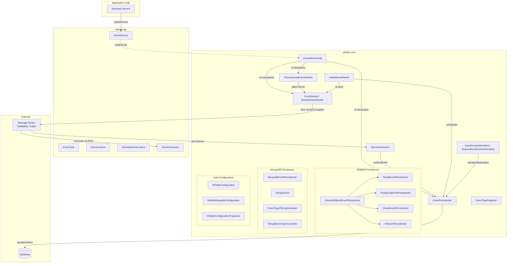
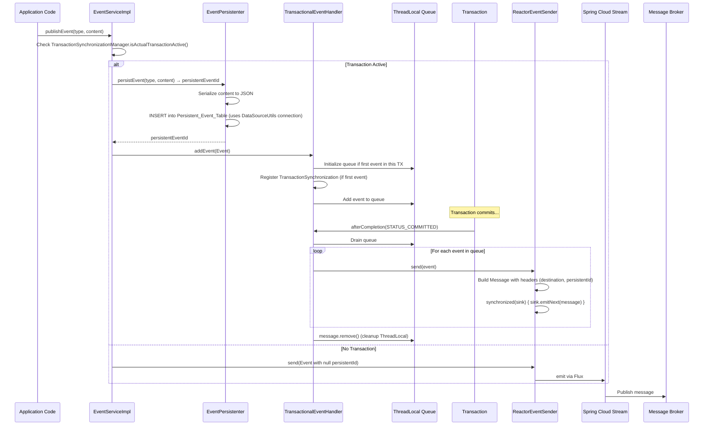
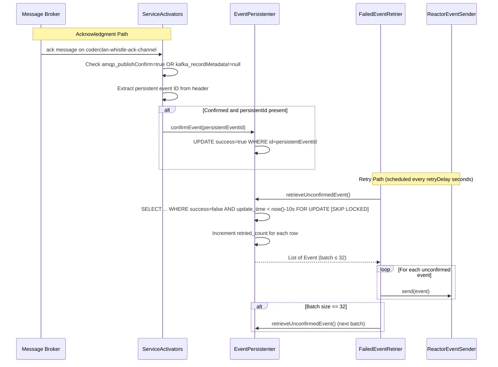

# Design Document: Whistle Event System

## Overview

Whistle is a reliable event delivering and consuming library for Java Spring Boot applications. It implements the Transactional Outbox pattern to solve the dual-write problem in Event-Driven Architecture: business data and events are persisted atomically within the same database transaction, then events are asynchronously published to a message broker (RabbitMQ or Kafka) via Spring Cloud Stream after the transaction commits. Broker acknowledgments confirm delivery, and a scheduled retrier re-sends any unconfirmed events.

### 兼容性

| 维度 | 支持范围 | 备注 |
|---|---|---|
| Java | 8+ (8, 11, 17, 21) | 公共 API (`whistle-api`) 仅使用 Java 8 API |
| Spring Boot | 2.x (2.6.4+) 和 3.x | 当前代码已在 Spring Boot 2 和 Spring Boot 3 环境中验证通过 |
| Spring Cloud | 2020.0.4+ (对应 Spring Boot 2.x), 2022.0.x+ (对应 Spring Boot 3.x) | 通过 Spring Cloud Stream 抽象消息中间件 |
| javax/jakarta | 同时兼容 javax 和 jakarta 命名空间 | 通过双注解叠加策略实现 |

### javax/jakarta 命名空间兼容策略

Spring Boot 3.x 基于 Jakarta EE 9+，将 `javax.*` 命名空间迁移为 `jakarta.*`。Whistle 通过以下策略同时兼容两个版本：

1. 对于生命周期注解（`@PostConstruct`），在同一方法上同时声明 `javax.annotation.PostConstruct` 和 `jakarta.annotation.PostConstruct`。运行时 JVM 会忽略找不到的注解类，因此：
   - Spring Boot 2.x 环境：`javax.annotation.PostConstruct` 生效，`jakarta.annotation.PostConstruct` 被忽略
   - Spring Boot 3.x 环境：`jakarta.annotation.PostConstruct` 生效，`javax.annotation.PostConstruct` 被忽略

2. `jakarta.annotation-api` 以 `provided` scope 声明，不会传递到应用的运行时 classpath。

3. `javax.sql.DataSource` 属于 Java SE 标准库（`java.sql` 模块），不受 Jakarta EE 命名空间迁移影响，无需特殊处理。

4. 除 `@PostConstruct` 外，Whistle 不使用任何其他 Java EE 的 javax.* API（如 `javax.inject`、`javax.persistence`），全部依赖 Spring Framework 自身的注解（`@Autowired`、`@Configuration` 等）。

### 双版本自动配置策略

为同时支持 Spring Boot 2.x 和 3.x，Whistle 采用双注册机制：

- `META-INF/spring.factories` — Spring Boot 2.x 的自动配置发现机制
- `META-INF/spring/org.springframework.boot.autoconfigure.AutoConfiguration.imports` — Spring Boot 3.x 的自动配置发现机制

两个文件引用相同的配置类（`WhistleConfiguration` 和 `WhistleMongodbConfiguration`），确保在两个主版本上行为一致。Spring Boot 2.x 忽略 `AutoConfiguration.imports` 文件，Spring Boot 3.x 优先使用 `AutoConfiguration.imports` 但也兼容 `spring.factories`，因此两者共存不会产生冲突。

The project is organized as a multi-module Maven project (version 1.2.0):

| Module | Purpose |
|---|---|
| `whistle-api` | Public API interfaces (`EventService`, `EventType`, `EventContent`, `EventConsumer`) with zero framework dependencies |
| `whistle` | Core implementation: persistence, sending, retry, auto-configuration |
| `whistle-example-producer-api` | Shared event type definitions for examples |
| `whistle-example-producer` | RDBMS-based producer example |
| `whistle-example-producer-mongo` | MongoDB-based producer example |
| `whistle-example-consumer` | Consumer example |

Key design decisions:
- **Transactional Outbox pattern** ensures events are never lost even if the broker is temporarily unavailable.
- **Database-agnostic persistence** via the Template Method pattern, with concrete implementations for MySQL, PostgreSQL, Oracle, H2, and MongoDB.
- **Spring Boot auto-configuration** with `@ConditionalOnClass` / `@ConditionalOnBean` / `@ConditionalOnMissingBean` for zero-config setup.
- **Reactor Sinks.Many** as the bridge between imperative event publishing and Spring Cloud Stream's reactive Supplier model.
- **SKIP LOCKED** used when the database supports it, to enable concurrent retry without row-level contention.

## Architecture



### Transactional Publish Flow



### Acknowledgment and Retry Flow



## Components and Interfaces

### whistle-api Module

| Interface/Class | Responsibility |
|---|---|
| `EventService` | Single method `publishEvent(EventType, EventContent)` — the public API for producers |
| `EventType<C>` | Identifies an event category: `getName()` returns a globally unique name, `getContentType()` returns the `Class<C>` |
| `EventContent` | Marker interface extending `Serializable` — the event payload contract |
| `AbstractEventContent` | Base class providing UUID-based `idempotentId` and `Instant time`; `equals`/`hashCode` based on `idempotentId` |
| `EventConsumer<E>` | Extends `Consumer<E>`. Implementations provide `getSupportEventType()` and `consume(E)`. The default `accept()` wraps failures in `ConsumerException` |
| `ConsumerException` | RuntimeException wrapping consumer failures |

### whistle Core Module

| Interface/Class | Responsibility |
|---|---|
| `EventServiceImpl` | Implements `EventService`. If a TX is active: persist + queue via `TransactionalEventHandler`. Otherwise: send directly. `@ThreadSafe` |
| `TransactionalEventHandler` | Uses `ThreadLocal<Queue<Event>>` and `TransactionSynchronization.afterCompletion()` to send events only after TX commit. `@ThreadSafe` |
| `EventSender` | Interface: `send(Event)` and `asFlux()` |
| `ReactorEventSender` | Implements `EventSender` using `Sinks.Many<Message<EventContent>>` (unicast, backpressure buffer). `synchronized(sink)` for thread safety |
| `EventPersistenter` | Interface: `persistEvent()`, `confirmEvent()`, `retrieveUnconfirmedEvent()` |
| `AbstractRdbmsEventPersistenter` | Template Method base for RDBMS. Handles table creation, SKIP LOCKED detection, insert/confirm/retrieve logic. Uses `DataSourceUtils.getConnection()` for TX participation |
| `MysqlEventPersistenter` | MySQL-specific SQL (AUTO_INCREMENT, `now()` syntax) |
| `PostgresqlEventPersistenter` | PostgreSQL-specific SQL (bigserial, trigger for update_time) |
| `OracleEventPersistenter` | Oracle-specific SQL (SEQUENCE, NUMBER types, TRIGGER) |
| `H2EventPersistenter` | H2-specific SQL (AUTO_INCREMENT, ON UPDATE CURRENT_TIMESTAMP) |
| `MongodbEventPersistenter` | MongoDB implementation using `MongoTemplate`. Partial index on `confirmed:false` |
| `MongoEvent<C>` | `@Document("sys_event_out")` — MongoDB document model |
| `EventType2StringConverter` | `@WritingConverter` — `EventType` → `String` for MongoDB |
| `String2EventTypeConverter` | `@ReadingConverter` — `String` → `EventType` via `EventTypeRegistrar` |
| `FailedEventRetrier` | `ApplicationListener<ApplicationStartedEvent>`. Starts a `ScheduledExecutorService` that polls unconfirmed events every `retryDelay` seconds |
| `ServiceActivators` | `@ServiceActivator` on `coderclan-whistle-ack-channel` for broker acks; `errorChannel` for errors |
| `EventContentSerializer` | Interface: `toJson(EventContent)` and `toEventContent(String, Class)` |
| `JacksonEventContentSerializer` | Jackson `ObjectMapper`-based implementation |
| `EventTypeRegistrar` | Collects all `EventType` instances into an immutable `Map<String, EventType>`. Throws `DuplicatedEventTypeException` on name collision. `@ThreadSafe` |
| `Event<C>` | `@Immutable` value object: `persistentEventId`, `type`, `content` |
| `Constants` | `EVENT_PERSISTENT_ID_HEADER = "org-coderclan-whistle-persistent-id"`, `RETRY_BATCH_COUNT = 32` |
| `WhistleConfigurationProperties` | `@ConfigurationProperties("org.coderclan.whistle")`: `retryDelay` (default 10), `applicationName` (default `spring.application.name`), `persistentTableName` (default `sys_event_out`) with backward-compatible `org.coderclan.whistle.table.producedEvent` |
| `WhistleConfiguration` | Main `@Configuration`. Auto-configures all beans. Validates no overlap between produced and consumed event types. Registers consumer bindings via `System.setProperty()` |
| `WhistleMongodbConfiguration` | `@Configuration` conditional on `MongoCustomConversions.class`. Registers MongoDB persistenter and custom converters |

### Exception Hierarchy

### Design Decision: JSON-Based String Serialization for EventContentSerializer

The `EventContentSerializer` interface uses `String` (JSON text) as the serialization format rather than `byte[]` (which would support binary protocols like Protobuf). This is a deliberate design choice:

- JSON covers the vast majority of event-driven use cases. Transactional outbox events are typically business domain events (order created, payment processed), not high-throughput RPC payloads where binary serialization matters.
- The performance bottleneck in the transactional outbox pattern is the database write (INSERT within a transaction), not serialization. Switching to Protobuf would not meaningfully improve end-to-end latency.
- JSON is human-readable, which is critical for debugging, log inspection, and manual database queries against the `sys_event_out` table. Binary formats require additional tooling to inspect.
- JSON is natively supported by all message brokers (RabbitMQ, Kafka) and all databases (varchar columns). Binary formats would require schema changes (`BLOB`/`BYTEA`) and broker configuration changes.
- The `@ConditionalOnMissingBean` guard on the serializer bean already allows users to provide a custom `EventContentSerializer` implementation for specialized needs (e.g., a Protobuf-to-JSON bridge).
- Changing to `byte[]` would be a breaking change affecting the interface, all persistenter implementations, the database schema, and the message wire format — a scope far beyond what any single feature should introduce.

If binary protocol support is needed in the future, it should be introduced as a new `EventContentCodec` interface in a major version release, with a backward-compatible adapter for the existing `EventContentSerializer`.

### Exception Hierarchy

| Exception | Module | Thrown When |
|---|---|---|
| `ConsumerException` | whistle-api | Consumer returns false or throws |
| `DuplicatedEventTypeException` | whistle | Two different EventType instances share the same name |
| `EventContentSerializationException` | whistle | Jackson serialization/deserialization fails |
| `EventContentDeserializationException` | whistle | (Available but currently `EventContentSerializationException` is used for both directions) |
| `EventContentTypeNotFoundException` | whistle | Event type name not found in registrar |

## Data Models

### Event<C> (Internal Value Object)

```java
@Immutable
public class Event<C extends EventContent> {
    private final String persistentEventId;  // nullable (null when no TX)
    private final EventType<C> type;
    private final C content;
}
```

`equals`/`hashCode` based on `type` and `content` (not `persistentEventId`).

### AbstractEventContent (API Base Class)

```java
public abstract class AbstractEventContent implements EventContent {
    private String idempotentId = UUID.randomUUID().toString();
    private Instant time = Instant.now();
}
```

`equals`/`hashCode` based solely on `idempotentId`.

### RDBMS Persistent_Event_Table Schema

Default table name: `sys_event_out` (configurable via `org.coderclan.whistle.persistentTableName`).

| Column | MySQL | PostgreSQL | Oracle | H2 |
|---|---|---|---|---|
| `id` | `int unsigned AUTO_INCREMENT` PK | `bigserial` PK | `NUMBER DEFAULT SEQ.NEXTVAL` PK | `int AUTO_INCREMENT` PK |
| `event_type` | `varchar(128)` | `varchar(128)` | `VARCHAR2(128)` | `varchar(128)` |
| `retried_count` | `int unsigned DEFAULT 0` | `int DEFAULT 0` | `NUMBER DEFAULT 0` | `int DEFAULT 0` |
| `event_content` | `varchar(4096)` | `varchar(4096)` | `VARCHAR2(2000)` | `varchar(4096)` |
| `success` | `boolean DEFAULT false` | `boolean DEFAULT false` | `NUMBER(1,0) DEFAULT 0` | `boolean DEFAULT false` |
| `create_time` | `timestamp DEFAULT CURRENT_TIMESTAMP` | `timestamp DEFAULT CURRENT_TIMESTAMP` | `TIMESTAMP DEFAULT current_timestamp` | `timestamp DEFAULT CURRENT_TIMESTAMP` |
| `update_time` | `timestamp DEFAULT CURRENT_TIMESTAMP ON UPDATE CURRENT_TIMESTAMP` | `timestamp DEFAULT CURRENT_TIMESTAMP` (trigger-updated) | `TIMESTAMP DEFAULT current_timestamp` (trigger-updated) | `timestamp DEFAULT CURRENT_TIMESTAMP ON UPDATE CURRENT_TIMESTAMP` |

PostgreSQL and Oracle use database triggers to auto-update `update_time` on row modification.

### MongoEvent (MongoDB Document)

```java
@Document("sys_event_out")
public class MongoEvent<C extends EventContent> {
    @Id
    private String id;
    private final EventType<C> type;    // stored as String via EventType2StringConverter
    private final C content;
    @Indexed(partialFilter = "{confirmed:false}")
    private Boolean confirmed = false;
    private Integer retry = 0;
}
```

### Spring Cloud Stream Default Properties

Loaded from `spring-cloud-stream.properties`:

```properties
spring.cloud.stream.poller.maxMessagesPerPoll=256
spring.rabbitmq.publisher-confirm-type=correlated
spring.rabbitmq.publisher-returns=true
spring.cloud.stream.default.producer.errorChannelEnabled=true
spring.cloud.stream.rabbit.default.consumer.auto-bind-dlq=true
spring.cloud.stream.rabbit.default.producer.confirm-ack-channel=coderclan-whistle-ack-channel
spring.cloud.stream.kafka.binder.autoCreateTopics=true
spring.cloud.stream.kafka.binder.minPartitionCount=8
spring.cloud.stream.kafka.default.consumer.enableDlq=true
spring.cloud.stream.kafka.default.producer.recordMetadataChannel=coderclan-whistle-ack-channel
```


## Correctness Properties

*A property is a characteristic or behavior that should hold true across all valid executions of a system — essentially, a formal statement about what the system should do. Properties serve as the bridge between human-readable specifications and machine-verifiable correctness guarantees.*

### Property 1: Transactional publish persists and queues

*For any* valid EventType and EventContent, when `publishEvent()` is called while a database transaction is active, the event SHALL be persisted via `EventPersistenter.persistEvent()` and the resulting Event (with the returned persistent ID) SHALL be added to the `TransactionalEventHandler` queue.

**Validates: Requirements 1.1**

### Property 2: Committed transaction sends all queued events

*For any* list of events added to the `TransactionalEventHandler` during a transaction, when `afterCompletion` is called with `STATUS_COMMITTED`, all events in the ThreadLocal queue SHALL be forwarded to `EventSender.send()` in order, and the ThreadLocal SHALL be cleaned up.

**Validates: Requirements 1.2**

### Property 3: Rolled-back transaction discards all queued events

*For any* list of events added to the `TransactionalEventHandler` during a transaction, when `afterCompletion` is called with a status other than `STATUS_COMMITTED`, zero events SHALL be forwarded to `EventSender.send()`, and the ThreadLocal SHALL be cleaned up.

**Validates: Requirements 1.3**

### Property 4: Non-transactional publish sends directly without persistence

*For any* valid EventType and EventContent, when `publishEvent()` is called while no database transaction is active, the event SHALL be sent directly via `EventSender.send()` with a null persistent event ID, and `EventPersistenter.persistEvent()` SHALL NOT be called.

**Validates: Requirements 1.4**

### Property 5: ThreadLocal isolates events between concurrent transactions

*For any* two threads each adding events to the `TransactionalEventHandler`, the events added by one thread SHALL NOT be visible to or sent by the other thread's transaction synchronization callback.

**Validates: Requirements 1.5, 14.3**

### Property 6: EventTypeRegistrar collects all registered types

*For any* set of publishing EventType collections and EventConsumer beans, the `EventTypeRegistrar` SHALL contain every EventType from both sources, and `findEventType(name)` SHALL return the correct EventType for each registered name.

**Validates: Requirements 2.1**

### Property 7: Duplicate event type names are rejected

*For any* two distinct EventType instances that return the same value from `getName()`, constructing an `EventTypeRegistrar` with both SHALL throw a `DuplicatedEventTypeException`.

**Validates: Requirements 2.3**

### Property 8: Producing and consuming the same event type is rejected

*For any* EventType that appears in both the publishing event type collections and the consumer event type set, the `WhistleConfiguration.checkEventType()` method SHALL throw an `IllegalStateException`.

**Validates: Requirements 2.5**

### Property 9: RDBMS persist inserts correct data and returns generated ID

*For any* valid EventType and EventContent, `AbstractRdbmsEventPersistenter.persistEvent()` SHALL insert a row with the event type name (from `EventType.getName()`) and the JSON-serialized content (from `EventContentSerializer.toJson()`), and return a non-null string representing the generated primary key.

**Validates: Requirements 3.1**

### Property 10: RDBMS confirm marks event as successful

*For any* valid persistent event ID, `AbstractRdbmsEventPersistenter.confirmEvent()` SHALL execute an UPDATE statement that sets the success flag to true for the row with that ID.

**Validates: Requirements 3.2**

### Property 11: RDBMS retrieve returns bounded batch with incremented retry count

*For any* set of unconfirmed events in the Persistent_Event_Table with update_time older than 10 seconds, `retrieveUnconfirmedEvent()` SHALL return at most 32 events and SHALL increment the `retried_count` for each returned event.

**Validates: Requirements 3.3**

### Property 12: SKIP LOCKED SQL generation matches database capability

*For any* database product name and version string, the `AbstractRdbmsEventPersistenter` SHALL generate a retrieve SQL containing `SKIP LOCKED` if and only if the detected version meets the minimum threshold (MySQL 8.0+, PostgreSQL 9.5+, Oracle 9.0+, MariaDB 10.3+, H2 1.5+). Otherwise, the SQL SHALL use `ORDER BY update_time, id` with `FOR UPDATE`.

**Validates: Requirements 3.4, 3.5**

### Property 13: MongoDB persist creates document with correct defaults

*For any* valid EventType and EventContent, `MongodbEventPersistenter.persistEvent()` SHALL insert a MongoEvent document with `confirmed=false` and `retry=0`, and return a non-null document ID.

**Validates: Requirements 4.1**

### Property 14: MongoDB confirm sets confirmed to true

*For any* valid persistent event ID, `MongodbEventPersistenter.confirmEvent()` SHALL update the corresponding MongoEvent document to set `confirmed=true`.

**Validates: Requirements 4.2**

### Property 15: MongoDB retrieve returns ordered bounded batch with incremented retry

*For any* set of unconfirmed MongoEvent documents, `retrieveUnconfirmedEvent()` SHALL return at most 32 documents ordered by retry ascending then ID ascending, and SHALL increment the retry counter for all retrieved documents.

**Validates: Requirements 4.3**

### Property 16: Retry loop continues until batch is not full

*For any* number N of unconfirmed events in the database, the `FailedEventRetrier` runnable SHALL call `retrieveUnconfirmedEvent()` ceil(N/32) times (continuing while each batch returns exactly 32 events) and SHALL send each retrieved event via `EventSender.send()`.

**Validates: Requirements 6.3**

### Property 17: Event message contains correct headers and payload

*For any* Event with a given EventType, EventContent, and persistent event ID, `ReactorEventSender.send()` SHALL produce a Spring Message where the payload equals the EventContent, the `spring.cloud.stream.sendto.destination` header equals `EventType.getName()`, and the `org-coderclan-whistle-persistent-id` header equals the persistent event ID.

**Validates: Requirements 7.2**

### Property 18: Concurrent sends preserve all messages

*For any* set of events sent concurrently from multiple threads to `ReactorEventSender`, all events SHALL appear in the output Flux with no losses or duplicates.

**Validates: Requirements 7.4, 14.4**

### Property 19: Broker acknowledgment triggers event confirmation

*For any* acknowledgment message received on the `coderclan-whistle-ack-channel` that contains a non-null persistent event ID header and a positive confirmation signal (either `amqp_publishConfirm=true` or a non-null `kafka_recordMetadata`), `ServiceActivators.acks()` SHALL call `EventPersistenter.confirmEvent()` with that persistent event ID.

**Validates: Requirements 8.1, 8.2**

### Property 20: Serialization round trip preserves EventContent

*For any* valid EventContent object and its corresponding content type class, `toEventContent(toJson(content), contentType)` SHALL produce an object equal to the original content.

**Validates: Requirements 9.1, 9.2, 9.5**

### Property 21: Consumer binding uses event type name

*For any* EventConsumer bean with a given bean name and EventType, the `WhistleConfiguration.registerEventConsumers()` method SHALL set the system property `spring.cloud.stream.function.bindings.<beanName>-in-0` to the value of `EventType.getName()`.

**Validates: Requirements 10.2**

### Property 22: Consumer accept() wraps failures in ConsumerException

*For any* EventConsumer whose `consume()` method either returns false or throws an exception, calling `accept()` SHALL throw a `ConsumerException`.

**Validates: Requirements 10.4, 10.5**

### Property 23: Deprecated table name fallback

*For any* configuration where `persistentTableName` is at its default value (`sys_event_out`) and the deprecated property `org.coderclan.whistle.table.producedEvent` is set to a non-empty value, `getPersistentTableName()` SHALL return the deprecated property's value.

**Validates: Requirements 11.5**

### Property 24: AbstractEventContent construction invariants

*For any* newly constructed AbstractEventContent instance, the `idempotentId` SHALL be a non-null valid UUID string, and the `time` SHALL be a non-null Instant that is not after `Instant.now()`.

**Validates: Requirements 13.1, 13.2**

### Property 25: AbstractEventContent equality based on idempotentId

*For any* two AbstractEventContent instances, they SHALL be equal (via `equals()`) if and only if their `idempotentId` values are equal, and their `hashCode()` values SHALL be consistent with equals.

**Validates: Requirements 13.3**

### Property 26: Dual auto-configuration registration for Spring Boot 2.x and 3.x

*For any* Spring Boot application using Whistle as a dependency, the auto-configuration classes (`WhistleConfiguration`, `WhistleMongodbConfiguration`) SHALL be discoverable via `spring.factories` on Spring Boot 2.x and via `AutoConfiguration.imports` on Spring Boot 3.x, and both mechanisms SHALL reference the same configuration classes.

**Validates: Requirements 15.4, 18.1, 18.2, 18.3**

### Property 27: javax/jakarta dual annotation compatibility

*For any* method in the Whistle codebase that uses `@PostConstruct`, the method SHALL be annotated with both `javax.annotation.PostConstruct` and `jakarta.annotation.PostConstruct`, ensuring that exactly one annotation is resolved at runtime regardless of whether the application runs on Spring Boot 2.x (javax) or Spring Boot 3.x (jakarta).

**Validates: Requirements 16.1**

## Error Handling

The Whistle system employs a layered error handling strategy:

### Exception Types

| Exception | Thrown By | Handling |
|---|---|---|
| `EventContentSerializationException` | `JacksonEventContentSerializer` | Propagated to caller. Wraps Jackson `JsonProcessingException` for both serialization and deserialization failures |
| `EventContentDeserializationException` | Available but unused | Defined for future use; currently `EventContentSerializationException` covers both directions |
| `DuplicatedEventTypeException` | `EventTypeRegistrar` | Fatal at startup. Thrown when two different EventType instances share the same name |
| `EventContentTypeNotFoundException` | Available for `EventTypeRegistrar.findEventType()` | Defined for cases where an event type name is not found in the registry |
| `ConsumerException` | `EventConsumer.accept()` | Wraps any exception or false return from `consume()`. Propagated to Spring Cloud Stream for DLQ handling |
| `IllegalStateException` | `WhistleConfiguration` | Fatal at startup. Thrown when application name is missing or when the same event type is both produced and consumed |
| `RuntimeException` | `AbstractRdbmsEventPersistenter.persistEvent()` | Wraps SQL exceptions during event insertion |

### Error Recovery Patterns

1. **Transactional Event Handler**: If `EventSender.send()` throws during the `afterCompletion` callback, the exception is caught and logged. The events are already persisted in the database, so the `FailedEventRetrier` will pick them up.

2. **Failed Event Retrier**: The entire retry cycle is wrapped in a try-catch. Any exception is logged, and the scheduler continues with the next cycle. This prevents transient failures from killing the retry mechanism.

3. **RDBMS Persistence**: 
   - `persistEvent()`: SQL exceptions are wrapped in `RuntimeException` and propagated, causing the enclosing transaction to roll back.
   - `confirmEvent()`: SQL exceptions are caught and logged (non-fatal, the event will be retried).
   - `retrieveUnconfirmedEvent()`: Exceptions are caught and logged; returns an empty list. Auto-commit is restored in a finally block.
   - `createTable()`: Each DDL statement is individually try-caught. Failures are logged at debug level (table may already exist).

4. **Service Activators**: Error messages on the `errorChannel` are logged. Acknowledgment processing silently skips if the persistenter is null or the persistent ID is missing.

5. **Spring Cloud Stream Integration**: Dead-letter queues (DLQ) are enabled by default for both RabbitMQ and Kafka consumers, ensuring that messages that fail consumer processing are not lost.

## Testing Strategy

### Dual Testing Approach

Testing for Whistle requires both unit tests and property-based tests:

- **Unit tests**: Verify specific examples, edge cases, integration points, and error conditions (e.g., startup validation failures, specific SQL generation for a known database version, configuration property defaults).
- **Property-based tests**: Verify universal properties that must hold across all valid inputs (e.g., serialization round-trip, ThreadLocal isolation, batch size invariants, message header correctness).

### Property-Based Testing Configuration

- **Library**: [jqwik](https://jqwik.net/) — a mature property-based testing library for Java that integrates with JUnit 5.
- **Minimum iterations**: 100 per property test.
- **Each property test must reference its design document property** using the tag format:
  `Feature: whistle-event-system, Property {number}: {property_text}`
- **Each correctness property SHALL be implemented by a single property-based test.**

### Unit Test Focus Areas

- Startup validation: null/empty application name throws `IllegalStateException`
- Startup validation: overlapping producer/consumer event types throws `IllegalStateException`
- Configuration property defaults: `retryDelay=10`, `persistentTableName=sys_event_out`
- Deprecated property fallback for table name
- Auto-configuration conditional bean creation (integration tests with Spring context)
- `createTable()` DDL execution and idempotency
- Error channel logging in `ServiceActivators`
- `FailedEventRetrier` does not start when no `EventPersistenter` is available
- Serialization/deserialization exception wrapping

### Property Test Focus Areas

- **Serialization round trip** (Property 20): Generate random `AbstractEventContent` subclass instances, serialize to JSON, deserialize back, assert equality.
- **TransactionalEventHandler commit/rollback** (Properties 2, 3): Generate random lists of events, simulate commit and rollback, verify send/discard behavior.
- **ThreadLocal isolation** (Property 5): Generate events on multiple threads, verify no cross-thread leakage.
- **EventTypeRegistrar duplicate detection** (Property 7): Generate pairs of EventType instances with same names, verify exception.
- **SKIP LOCKED detection** (Property 12): Generate database product name/version combinations, verify SQL output.
- **Batch size invariant** (Properties 11, 15): Generate sets of unconfirmed events, verify retrieval returns ≤ 32.
- **Message header correctness** (Property 17): Generate random events, verify message structure.
- **Consumer failure wrapping** (Property 22): Generate consumers that fail in various ways, verify ConsumerException.
- **AbstractEventContent invariants** (Properties 24, 25): Generate instances, verify UUID validity, timestamp bounds, and equality semantics.
- **Concurrent send safety** (Property 18): Generate events sent from multiple threads, verify all appear in Flux.


---

## Addendum: Spring Boot 4 / Java 25 Compatibility Design

> This section covers the design for Spring Boot 4.x (Spring Framework 7) and Java 25 compatibility.
> It addresses Requirements 15-21 and the 9 issues identified in the [Spring Boot 4 Compatibility Report](spring-boot-4-compatibility-report.md).
> After all implementation tasks are complete, this section will be consolidated into the main design document.

### Updated Compatibility Matrix

| Dimension | Supported Range | Notes |
|---|---|---|
| Java | 8+ (8, 11, 17, 21, 25) | Public API (`whistle-api`) uses only Java 8 APIs |
| Spring Boot | 2.x (2.6.4+), 3.x, and 4.x | Verified on Spring Boot 2, 3, and 4 environments |
| Spring Cloud | 2020.0.4+ (Spring Boot 2.x), 2022.0.x+ (Spring Boot 3.x), 2025.1.0 (Spring Boot 4.x) | Message broker abstracted via Spring Cloud Stream |
| javax/jakarta | Compatible with both javax and jakarta namespaces | Dual-annotation strategy for 2.x; jakarta-only for 3.x/4.x |
| Jackson | Jackson 2 (`com.fasterxml.jackson`) and Jackson 3 (`tools.jackson`) | Version-adaptive mechanism selects at runtime based on classpath |

### Issue Summary from Compatibility Report

| # | Severity | Issue | Design Solution |
|---|---|---|---|
| B1 | BLOCKING | WhistleConfiguration references relocated DataSourceAutoConfiguration | String-based `@AutoConfigureAfter(name=...)` |
| B2 | BLOCKING | WhistleMongodbConfiguration references relocated MongoAutoConfiguration | String-based `@AutoConfigureAfter(name=...)` |
| B3 | BLOCKING | Jackson 2 not on classpath; Spring Boot 4 uses Jackson 3 | Separate Jackson 2/3 configuration classes |
| B4 | BLOCKING | WhistleConfiguration method signatures reference Jackson 2 ObjectMapper | Move Jackson bean out of WhistleConfiguration |
| M1 | MAJOR | javax.annotation.PostConstruct not available in Spring Boot 4 | Remove javax, keep jakarta only |
| M2 | MAJOR | Application only starts after excluding Whistle configurations | Fixed by B1 + B2 |
| m1 | MINOR | spring.factories no longer used in Spring Boot 4 | Already has AutoConfiguration.imports; no change needed |
| m2 | MINOR | @EnableBinding/@StreamListener removed in Spring Cloud Stream 5.0 | Whistle already uses functional model; no change needed |
| m3 | MINOR | RabbitAutoConfiguration relocated | Whistle does not reference it directly; no change needed |

### Design 1: Auto-Configuration Class Path Migration (B1, B2, M2)

In Spring Boot 4, several auto-configuration classes have been relocated:

| Old Path (Spring Boot 2.x/3.x) | New Path (Spring Boot 4.x) |
|---|---|
| `o.s.b.autoconfigure.jdbc.DataSourceAutoConfiguration` | `o.s.b.jdbc.autoconfigure.DataSourceAutoConfiguration` |
| `o.s.b.autoconfigure.mongo.MongoAutoConfiguration` | `o.s.b.mongodb.autoconfigure.MongoAutoConfiguration` |

**Solution: String-based class name references in annotations.**

Spring's `@AutoConfigureAfter` and `@ConditionalOnClass` support a `name` attribute that accepts fully qualified class names as strings. When the referenced class is not on the classpath, the string-based reference does not trigger `ClassNotFoundException`.

For `WhistleConfiguration`:
```java
@AutoConfigureAfter(name = {
    "org.springframework.boot.autoconfigure.jdbc.DataSourceAutoConfiguration",  // Spring Boot 2.x/3.x
    "org.springframework.boot.jdbc.autoconfigure.DataSourceAutoConfiguration"   // Spring Boot 4.x
})
```

For `WhistleMongodbConfiguration`:
```java
@AutoConfigureAfter(name = {
    "org.springframework.boot.autoconfigure.mongo.MongoAutoConfiguration",    // Spring Boot 2.x/3.x
    "org.springframework.boot.mongodb.autoconfigure.MongoAutoConfiguration"   // Spring Boot 4.x
})
@ConditionalOnClass(MongoCustomConversions.class)  // stable across versions
```

Benefits:
- No compile-time or class-loading-time dependency on relocated classes.
- Works on all Spring Boot versions: the framework ignores names that don't resolve.
- No runtime version detection or reflection needed.

### Design 2: Jackson 2/3 Dual-Support (B3, B4)

Spring Boot 4 replaces Jackson 2 (`com.fasterxml.jackson`) with Jackson 3 (`tools.jackson`). This causes:
1. `JacksonEventContentSerializer` fails because `com.fasterxml.jackson.databind.ObjectMapper` is missing.
2. `WhistleConfiguration.eventContentSerializer()` method signature references Jackson 2 ObjectMapper, causing `NoClassDefFoundError` during reflection.

**Solution: Static inner configuration classes with `@ConditionalOnClass` inside a single file.**

The outer class (`WhistleJacksonConfiguration`) contains no Jackson imports. Two static inner `@Configuration` classes are each guarded by `@ConditionalOnClass` on the respective Jackson `ObjectMapper`. The JVM loads static inner classes lazily, so the Jackson 2 inner class is never loaded on Spring Boot 4 (where only Jackson 3 exists), and vice versa.

```mermaid
graph TB
    subgraph "WhistleJacksonConfiguration"
        WJC[WhistleJacksonConfiguration<br/>No Jackson imports]
        subgraph "Static Inner Classes"
            J2C[Jackson2Configuration<br/>@ConditionalOnClass Jackson 2 ObjectMapper]
            J3C[Jackson3Configuration<br/>@ConditionalOnClass Jackson 3 ObjectMapper]
        end
    end

    J2C -->|creates| J2S[JacksonEventContentSerializer]
    J3C -->|creates| J3S[Jackson3EventContentSerializer]
```

**WhistleJacksonConfiguration** (new class with static inner classes):
```java
@Configuration
public class WhistleJacksonConfiguration {

    @Configuration
    @ConditionalOnClass(name = "com.fasterxml.jackson.databind.ObjectMapper")
    static class Jackson2Configuration {
        @Bean
        @ConditionalOnMissingBean(EventContentSerializer.class)
        public EventContentSerializer eventContentSerializer(
                @Autowired com.fasterxml.jackson.databind.ObjectMapper objectMapper) {
            return new JacksonEventContentSerializer(objectMapper);
        }
    }

    @Configuration
    @ConditionalOnClass(name = "tools.jackson.databind.ObjectMapper")
    static class Jackson3Configuration {
        @Bean
        @ConditionalOnMissingBean(EventContentSerializer.class)
        public EventContentSerializer eventContentSerializer(
                @Autowired tools.jackson.databind.ObjectMapper objectMapper) {
            return new Jackson3EventContentSerializer(objectMapper);
        }
    }
}
```

`Jackson3EventContentSerializer`:
```java
public class Jackson3EventContentSerializer implements EventContentSerializer {
    private tools.jackson.databind.ObjectMapper objectMapper;

    public Jackson3EventContentSerializer(tools.jackson.databind.ObjectMapper objectMapper) {
        this.objectMapper = objectMapper;
    }

    @Override
    public EventContent toEventContent(String string, Class<? extends EventContent> contentType) {
        try {
            return this.objectMapper.readValue(string, contentType);
        } catch (tools.jackson.core.JacksonException e) {
            throw new EventContentSerializationException(e);
        }
    }

    @Override
    public <C extends EventContent> String toJson(C content) {
        try {
            return this.objectMapper.writeValueAsString(content);
        } catch (tools.jackson.core.JacksonException e) {
            throw new EventContentSerializationException(e);
        }
    }
}
```

Key decisions:
- `eventContentSerializer` bean removed from `WhistleConfiguration` to eliminate Jackson class references from its method signatures.
- Jackson 2 and Jackson 3 configurations are static inner classes of `WhistleJacksonConfiguration`. The JVM loads static inner classes lazily, so the guarded inner class is never loaded when its Jackson version is absent from the classpath.
- `@ConditionalOnMissingBean(EventContentSerializer.class)` on both ensures only one activates.
- `WhistleJacksonConfiguration` must use `@AutoConfigureBefore(name = "org.coderclan.whistle.WhistleConfiguration")` to ensure the `EventContentSerializer` bean is available before the persistenter beans in `WhistleConfiguration` that depend on it.
- Spring Boot 2.x/3.x → Jackson 2 on classpath → `Jackson2Configuration` activates.
- Spring Boot 4.x → Jackson 3 on classpath → `Jackson3Configuration` activates.
- Custom `EventContentSerializer` bean overrides both (existing behavior preserved).

**Compile-time dependency handling for Jackson 3:**

`Jackson3EventContentSerializer` references `tools.jackson` classes, which are not available at compile time when building against Spring Boot 2.x/3.x. To solve this:
- Add Jackson 3 (`tools.jackson.databind:jackson-databind`) as an `optional` Maven dependency in `whistle/pom.xml`. This makes it available at compile time but does not transitively propagate to consumers.
- At runtime on Spring Boot 2.x/3.x, Jackson 3 is not on the classpath, so `@ConditionalOnClass(name = "tools.jackson.databind.ObjectMapper")` prevents the inner class from being loaded.
- At runtime on Spring Boot 4.x, Jackson 3 is provided by Spring Boot's dependency management, so the inner class loads and activates normally.
- Similarly, Jackson 2 (`com.fasterxml.jackson.core:jackson-databind`) should be declared as `optional` (it is currently a transitive dependency via Spring Boot, but making it explicit and optional ensures clarity).

### Design 3: javax/jakarta Annotation Handling (M1)

Spring Framework 7 (Spring Boot 4) only processes `jakarta.annotation.PostConstruct`. The current dual-annotation approach causes issues on Spring Boot 4 because `javax.annotation.PostConstruct` is not on the classpath.

**Solution: Remove `@javax.annotation.PostConstruct`, keep only `@jakarta.annotation.PostConstruct`.**

1. Remove `import javax.annotation.PostConstruct` from `WhistleConfiguration`.
2. Remove the `@PostConstruct` annotation (javax) from the `init()` method.
3. Keep only `@jakarta.annotation.PostConstruct`.

This is safe for Spring Boot 3.x and 4.x, but NOT for Spring Boot 2.x:
- Spring Boot 2.x (Spring Framework 5.x): Only supports `javax.annotation.PostConstruct`. Spring Framework 5.x's `CommonAnnotationBeanPostProcessor` is hardcoded to the `javax.annotation` package and does NOT recognize `jakarta.annotation.PostConstruct`. Therefore, removing `@javax.annotation.PostConstruct` will break `@PostConstruct` lifecycle callbacks on Spring Boot 2.x.
- Spring Boot 3.x (Spring Framework 6.x): `jakarta.annotation.PostConstruct` is the standard.
- Spring Boot 4.x (Spring Framework 7.x): `jakarta.annotation.PostConstruct` is the only supported option.

**Impact on Spring Boot 2.x compatibility**: Removing `@javax.annotation.PostConstruct` means Whistle's `@PostConstruct`-annotated methods will NOT be invoked on Spring Boot 2.x. This is an acceptable trade-off if Spring Boot 2.x support is being deprecated, or an alternative initialization mechanism must be used.

**Alternative: Use `InitializingBean` for cross-version compatibility**

If Spring Boot 2.x support must be maintained, the `@PostConstruct` method can be replaced with Spring's `InitializingBean.afterPropertiesSet()` interface, which works on all Spring versions without any annotation dependency:

```java
public class WhistleConfiguration implements InitializingBean {
    @Override
    public void afterPropertiesSet() {
        // initialization logic previously in @PostConstruct init()
    }
}
```

This approach works on Spring Boot 2.x, 3.x, and 4.x without any javax/jakarta dependency.

### Design 4: Spring Cloud Stream 5.0 Compatibility (m2, m3)

No code changes needed. Whistle already uses the functional programming model (`Supplier<Flux<Message<EventContent>>>`) and does not reference `@EnableBinding`, `@StreamListener`, or `RabbitAutoConfiguration`.

### New Components Summary

| Class | Module | Responsibility |
|---|---|---|
| `WhistleJacksonConfiguration` | whistle | Outer `@Configuration` with no Jackson imports. Contains two static inner `@Configuration` classes for Jackson 2 and Jackson 3 |
| `WhistleJacksonConfiguration.Jackson2Configuration` | whistle | Static inner `@Configuration` conditional on Jackson 2 ObjectMapper. Creates `JacksonEventContentSerializer` bean. Active on Spring Boot 2.x/3.x |
| `WhistleJacksonConfiguration.Jackson3Configuration` | whistle | Static inner `@Configuration` conditional on Jackson 3 ObjectMapper. Creates `Jackson3EventContentSerializer` bean. Active on Spring Boot 4.x |
| `Jackson3EventContentSerializer` | whistle | Jackson 3 (`tools.jackson`) implementation of `EventContentSerializer`. Mirrors `JacksonEventContentSerializer` using Jackson 3 APIs |

### New Correctness Properties

#### Property 28: Version-adaptive auto-configuration class resolution

*For any* auto-configuration class reference used in Whistle's `@AutoConfigureAfter` annotations (DataSourceAutoConfiguration, MongoAutoConfiguration), the annotation SHALL specify both the old package path (Spring Boot 2.x/3.x) and the new package path (Spring Boot 4.x) using string-based `name` attributes, so that the annotation resolves correctly regardless of which Spring Boot version is on the classpath.

**Validates: Requirements 15.6, 19.1, 19.2, 19.4**

#### Property 29: Jackson version-adaptive serializer selection

*For any* classpath configuration, the Whistle auto-configuration SHALL activate exactly one Jackson-based `EventContentSerializer` bean: `JacksonEventContentSerializer` (Jackson 2) when `com.fasterxml.jackson.databind.ObjectMapper` is on the classpath, or `Jackson3EventContentSerializer` (Jackson 3) when `tools.jackson.databind.ObjectMapper` is on the classpath. If a custom `EventContentSerializer` bean is already defined, neither Jackson configuration SHALL activate.

**Validates: Requirements 20.1, 20.2, 20.5**

#### Property 30: Jackson 3 serialization round trip preserves EventContent

*For any* valid EventContent object and its corresponding content type class, serializing to JSON then deserializing back using Jackson 3 (`tools.jackson.databind.ObjectMapper`) SHALL produce an object equal to the original content.

**Validates: Requirements 20.4**

#### Property 31: WhistleConfiguration has no Jackson class references in method signatures

*For any* method declared in `WhistleConfiguration`, the method's parameter types and return type SHALL NOT reference any Jackson 2 class (`com.fasterxml.jackson.*`) or Jackson 3 class (`tools.jackson.*`), ensuring that reflection-based bean introspection does not trigger `NoClassDefFoundError` on any Spring Boot version.

**Validates: Requirements 20.3**

#### Property 32: Functional programming model for Spring Cloud Stream

*For any* Spring Cloud Stream integration point in Whistle, the library SHALL use only the functional programming model (`Supplier<Flux<Message>>` and `Consumer<Message>`) and SHALL NOT reference `@EnableBinding`, `@StreamListener`, or `RabbitAutoConfiguration` classes, ensuring compatibility with Spring Cloud Stream 4.x and 5.0.

**Validates: Requirements 21.1, 21.2, 21.4**

### Updated Properties (Superseding Original)

The following original properties are superseded by this addendum:

- **Property 26** → Updated: Auto-configuration registration now covers Spring Boot 4.x via `AutoConfiguration.imports`.
- **Property 27** → Updated: `@PostConstruct` methods SHALL use `jakarta.annotation.PostConstruct` only (not dual javax+jakarta).

---

## Addendum: Maven Profile-Based Multi-Version Verification

> This section covers the Maven profile strategy for verifying Whistle compatibility across Spring Boot 2.x, 3.x, and 4.x.
> After all implementation tasks are complete, this section will be consolidated into the main design document.

### Problem

The property tests (Properties 28–32) verify structural correctness via reflection and source scanning, but they do not boot a real Spring ApplicationContext against different Spring Boot versions. To gain confidence that Whistle works on Spring Boot 2, 3, and 4, we need a way to compile and run the example projects against each version.

### Solution: Maven Profiles in the Root POM

Define three Maven profiles in the root `pom.xml` that override the Spring Boot parent version, Spring Cloud version, and compiler source/target level. The developer switches profiles in IDEA's Maven panel (right sidebar → Maven → Profiles) and runs the example projects directly.

#### Profile Definitions

| Profile | Spring Boot | Spring Cloud | Java Source/Target | Notes |
|---|---|---|---|---|
| `spring-boot-2` (default) | 2.6.4 | 2020.0.4 | 8 | Current baseline |
| `spring-boot-3` | 3.4.4 | 2024.0.1 | 17 | Jakarta EE, Java 17+ required |
| `spring-boot-4` | 4.0.0 | 2025.1.0 | 17 | Jackson 3, Spring Framework 7 |

#### Key Design Decisions

1. **`spring-boot-2` is the default profile** (`<activeByDefault>true</activeByDefault>`), preserving the current behavior when no profile is explicitly selected.

2. **Spring Boot parent version override**: Profiles cannot change the `<parent>` element directly. Instead, we use `spring-boot.version` property combined with `spring-boot-dependencies` BOM import in `<dependencyManagement>` to override the version managed by the parent POM. The parent POM remains at 2.6.4 for structural inheritance, but the BOM import takes precedence for dependency resolution.

3. **Compiler level**: Spring Boot 3.x and 4.x require Java 17+. The profiles set `maven.compiler.source` and `maven.compiler.target` accordingly.

4. **Spring Cloud version**: Each Spring Boot major version requires a compatible Spring Cloud release train. The profiles set `spring-cloud.version` to match.

5. **`spring-boot-maven-plugin` version**: The example projects hardcode `spring-boot-maven-plugin` version `2.6.4`. The profiles override this via a `spring-boot-maven-plugin.version` property, and the example POMs are updated to use `${spring-boot-maven-plugin.version}` instead of a hardcoded version.

6. **Jackson 3 dependency version**: On Spring Boot 4, Jackson 3 is provided by the Spring Boot BOM, so the explicit `3.0.0` version in `whistle/pom.xml` is acceptable (the BOM will manage the actual resolved version). On Spring Boot 2/3, Jackson 3 remains optional and unused at runtime.

#### IDEA Workflow

1. Open the Maven panel (right sidebar → Maven icon)
2. Expand "Profiles"
3. Check the desired profile (e.g., `spring-boot-3`)
4. IDEA will reimport dependencies automatically
5. Run any example project's `main()` method directly

#### Limitations

- Switching profiles requires IDEA to re-resolve dependencies (takes a few seconds)
- The root POM `<parent>` still points to Spring Boot 2.6.4; the profile overrides via BOM import
- Example projects must not use version-specific APIs (javax vs jakarta) — currently they don't
